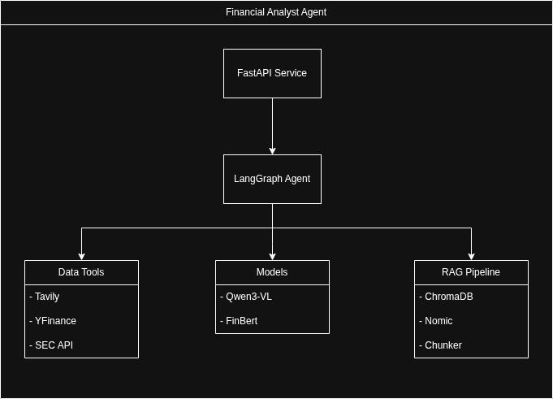
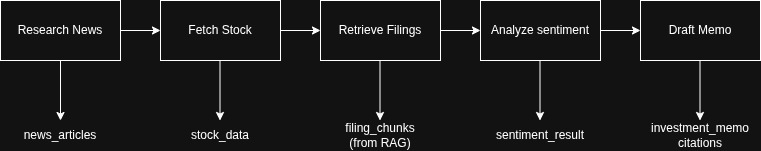

<div align="center">

# Financial Analyst Agent System

### AI-powered financial analyst agent that autonomously researches companies, analyzes SEC filings, evaluates market sentiment, and generates investment memos with citations. Built with LangGraph, RAG, and local LLMs.

[](https://www.python.org/downloads/)
[](https://github.com/langchain-ai/langgraph)
[](https://fastapi.tiangolo.com)
[](https://opensource.org/licenses/MIT)
[](https://github.com/psf/black)

**Autonomous agent that researches companies, analyzes SEC filings, evaluates market sentiment, and generates professional investment memos — all with verifiable citations.**

[Features](#-features) •
[Quick Start](#-quick-start) •
[Architecture](#-architecture) •
[API](#-api-reference) •
[Roadmap](#-roadmap)

</div>

---

## ✨ Features

<table>
<tr>
<td width="50%">

### 🔍 Multi-Source Research
- **News Search** via Tavily (LLM-optimized)
- **Stock Data** via YFinance (real-time quotes)
- **SEC Filings** via EDGAR API (10-K, 10-Q)

### 🧠 Advanced Analysis
- **RAG Pipeline** for intelligent filing retrieval
- **FinBERT Sentiment** analysis on news
- **Vision Support** for charts/tables (Qwen3-VL)

</td>
<td width="50%">

### 📝 Professional Output
- **Investment Memos** with structured sections
- **Verifiable Citations** for every claim
- **Executive Summaries** for quick review

### 🚀 Production Ready
- **FastAPI** with async job support
- **Health Checks** for all components
- **Graceful Degradation** on partial failures

</td>
</tr>
</table>

---

## Architecture
```


```

### Agent Workflow
```

```

---

## 🚀 Quick Start

### Prerequisites

- Python 3.12+
- [Ollama](https://ollama.ai/) running locally
- [Tavily API Key](https://tavily.com/) (free tier available)

### 1. Clone & Install
```bash
git clone https://github.com/yourusername/alpha-analyst.git
cd alpha-analyst
poetry install
```

### 2. Setup Models
```bash
# Pull required Ollama models
ollama pull qwen3-vl:8b
ollama pull nomic-embed-text
```

### 3. Configure Environment
```bash
cp .env.example .env
# Edit .env with your API keys
```
```env
TAVILY_API_KEY=tvly-xxxxxxxxxxxxx
OLLAMA_BASE_URL=http://localhost:11434
```

### 4. Index a Company
```bash
poetry run python rag/ingestion.py AAPL
```

### 5. Run Analysis
```bash
# Start API server
poetry run python api/main.py

# In another terminal
curl -X POST http://localhost:8000/analyze \
  -H "Content-Type: application/json" \
  -d '{"ticker": "AAPL"}'
```

---

##  API Reference

### Base URL
```
http://localhost:8000
```

<!-- ### Endpoints

| Method | Endpoint | Description |
|--------|----------|-------------|
| `POST` | `/analyze` | Run analysis (sync, blocks until complete) |
| `POST` | `/analyze/async` | Start analysis job (returns immediately) |
| `GET` | `/jobs/{job_id}` | Get job status and results |
| `POST` | `/ingest` | Index SEC filings for a company |
| `GET` | `/ingest/{ticker}` | Check if filings are indexed |
| `GET` | `/health` | Health check for all components |
| `GET` | `/stats` | System statistics |
| `GET` | `/docs` | Interactive API documentation | -->

### Example: Async Analysis
```bash
# 1. Start job
JOB_ID=$(curl -s -X POST http://localhost:8000/analyze/async \
  -H "Content-Type: application/json" \
  -d '{"ticker": "MSFT"}' | jq -r '.job_id')

# 2. Poll for results
curl http://localhost:8000/jobs/$JOB_ID | jq
```

### Response Schema
```json
{
  "job_id": "abc123",
  "ticker": "AAPL",
  "company_name": "Apple Inc",
  "status": "completed",
  "executive_summary": "Apple demonstrates strong fundamentals...",
  "investment_memo": "# Investment Memo: Apple Inc\n\n...",
  "stock_data": {
    "current_price": 185.50,
    "market_cap_formatted": "$2.85T",
    "pe_ratio": 28.5
  },
  "sentiment": {
    "overall_sentiment": "positive",
    "positive_count": 3,
    "negative_count": 1,
    "neutral_count": 1
  },
  "citations": [
    {"index": 1, "source_type": "news", "title": "...", "url": "..."}
  ],
  "execution_time_ms": 45230
}
```

---

## ⚙️ Configuration

All settings are managed via environment variables or `.env` file:

| Variable | Default | Description |
|----------|---------|-------------|
| `OLLAMA_BASE_URL` | `http://localhost:11434` | Ollama server URL |
| `OLLAMA_LLM_MODEL` | `qwen3-vl:8b` | LLM model for generation |
| `OLLAMA_EMBED_MODEL` | `nomic-embed-text` | Embedding model |
| `TAVILY_API_KEY` | - | Tavily API key (required) |
| `CHROMA_PERSIST_DIR` | `./data/chroma` | Vector store location |
| `SEC_USER_AGENT` | - | User agent for SEC API |

See [`.env.example`](.env.example) for all options.

---

## Testing
```bash
# Run unit tests
poetry run pytest tests/unit -v

# Run integration tests (requires API keys)
poetry run pytest tests/integration -v --run-integration
```

---

## Project Structure
```
alpha-analyst/
├── agent/
│   ├── state.py          # TypedDict state definition
│   └── graph.py          # LangGraph workflow
├── api/
│   ├── main.py           # FastAPI application
│   └── schemas.py        # Pydantic models
├── models/
│   ├── llm.py            # Ollama integration
│   └── sentiment.py      # FinBERT classifier
├── rag/
│   ├── embeddings.py     # Embedding generation
│   ├── vector_store.py   # ChromaDB wrapper
│   └── ingestion.py      # Document processing
├── tools/
│   ├── web_search.py     # Tavily integration
│   ├── stock_data.py     # YFinance integration
│   └── sec_filings.py    # SEC EDGAR integration
├── tests/
│   ├── unit/
│   └── integration/
├── config.py             # Settings management
└── pyproject.toml        # Dependencies
```

---

## Roadmap

### Phase 1: Core Agent (Done)
- [x] Multi-source data gathering
- [x] RAG pipeline for SEC filings
- [x] Sentiment analysis
- [x] Investment memo generation
- [] FastAPI service

### Phase 2: Enhanced Analysis
- [ ] Multi-company comparison
- [ ] Historical trend analysis
- [ ] Competitor identification
- [ ] Custom analysis templates

### Phase 3: Advanced Features
- [ ] LangSmith observability
- [ ] Streaming responses
- [ ] PDF report generation
- [ ] Scheduled analysis jobs
- [ ] Webhook notifications

### Phase 4: Scale & Deploy
- [ ] Redis job queue
- [ ] PostgreSQL persistence
- [ ] Docker compose setup
- [ ] Kubernetes manifests
- [ ] Cloud deployment guides

---

## Acknowledgments

- [LangChain](https://github.com/langchain-ai/langchain) & [LangGraph](https://github.com/langchain-ai/langgraph) for the agent framework
- [Ollama](https://ollama.ai/) for local LLM inference
- [ChromaDB](https://www.trychroma.com/) for vector storage
- [FinBERT](https://huggingface.co/ProsusAI/finbert) for financial sentiment analysis
- [Tavily](https://tavily.com/) for LLM-optimized search
- [SEC EDGAR](https://www.sec.gov/edgar) for financial filings

```