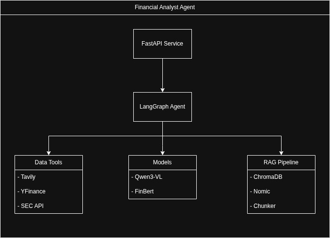
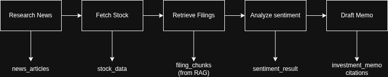

<div align="center">

# Financial Analyst Agent System

### AI-powered financial analyst agent that autonomously researches companies, analyzes SEC filings, evaluates market sentiment, and generates investment memos with citations. Built with LangGraph, RAG, and local LLMs.

[](https://www.python.org/downloads/)
[](https://github.com/langchain-ai/langgraph)
[](https://fastapi.tiangolo.com)
[](https://opensource.org/licenses/MIT)
[](https://github.com/psf/black)

**Autonomous agent that researches companies, analyzes SEC filings, evaluates market sentiment, and generates professional investment memos — all with verifiable citations.**

[Features](#-features) •
[Quick Start](#-quick-start) •
[Architecture](#-architecture) •
[API](#-api-reference) •
[Roadmap](#-roadmap)

</div>

---
## Features

<table>
<tr>
<td width="50%">

### Multi-Source Research
- **News Search** via Tavily (LLM-optimized)
- **Stock Data** via YFinance (real-time quotes)
- **SEC Filings** via EDGAR API (10-K, 10-Q)

### Advanced Analysis
- **RAG Pipeline** for intelligent filing retrieval
- **FinBERT Sentiment** analysis on news
- **Vision Support** for charts/tables (Qwen3-VL)

</td>
<td width="50%">

### Professional Output
- **Investment Memos** with structured sections
- **Source-linked citations** in API responses and generated memo flow
- **Executive Summaries** for quick review

### Production Ready
- **FastAPI** with async job support
- **Health Checks** for all components
- **Graceful Degradation** on partial failures

</td>
</tr>
</table>

---

## Architecture


### Agent Workflow



## Quick Start

### Prerequisites

- Python 3.12+
- [Ollama](https://ollama.ai/) running locally
- [Tavily API Key](https://tavily.com/) (free tier available)

---

##  API Reference

### Base URL
```
http://localhost:8000
```

### Endpoints

| Method | Endpoint | Description |
|--------|----------|-------------|
| `POST` | `/analyze` | Run analysis (sync, blocks until complete) |
| `POST` | `/analyze/async` | Start analysis job (returns immediately) |
| `GET` | `/jobs/{job_id}` | Async job status and completed result payload |
| `POST` | `/ingest` | Index SEC filings for a company |
| `GET` | `/ingest/{ticker}` | Check if filings are indexed |
| `GET` | `/health` | Health check for all components |
| `GET` | `/stats` | System statistics |
| `GET` | `/docs` | Interactive API documentation |

This project can:

* ingest SEC filings for a ticker,
* retrieve section-aware evidence from the vector store,
* fetch market and news context,
* run sentiment and structured analysis,
* generate an investment memo,
* expose the workflow through a FastAPI service.

## Current Status

**Single-agent financial analysis MVP** with:

* FastAPI service endpoints for analysis, ingestion, health, metrics, and run status,
* Chroma as the active vector backend,
* section-aware SEC ingestion and metadata-rich retrieval,
* evidence packet support for downstream grounding and citations,
* file-backed async run tracking,
* evaluation and observability scaffolding.

## Current Features (Completed and Tested)

* **Ticker analysis workflow**: synchronous and async analysis endpoints
* **SEC ingestion**: filing ingestion with section tracking
* **Retrieval**: Chroma-backed search with ticker / filing / section filtering
* **Evidence packets**: normalized retrieval units for memo grounding
* **Run tracking**: file-backed run store for async jobs
* **Observability**: health, metrics, and stats endpoints
* **Tests**: unit/integration coverage for the current API and run-store behavior

## TO-DO

* production-grade multi-agent system
* Qdrant-backed retrieval service
* hybrid dense+sparse retrieval stack
* reranker-driven evidence pipeline
* fully claim-verified citation engine
* horizontally scalable job system

Those are roadmap items, not current-state claims.

## Architecture at a Glance

```text
Ticker Request
  -> Market data + news collection
  -> SEC filing retrieval
  -> Section-aware chunk search
  -> Evidence packet construction
  -> Sentiment + structured analysis
  -> Memo generation
  -> API response
```

## Repository Layout

```text
Financial-Analyst-Agent/
├── agents/
├── api/
│   ├── main.py
│   ├── run_store.py
│   └── schemas.py
├── configs/
├── evaluation/
├── models/
├── observability/
├── rag/
│   ├── embeddings.py
│   ├── evidence.py
│   ├── ingestion.py
│   └── vector_store.py
├── scripts/
├── tests/
│   ├── eval/
│   ├── integration/
│   ├── unit/
│   ├── test_api_integration.py
│   ├── test_eval.py
│   └── test_run_store.py
├── tools/
├── Dockerfile
├── Makefile
├── docker-compose.yml
└── pyproject.toml
```

## Requirements

* Python 3.10+
* Ollama running locally
* Tavily API key for web/news search
* Local write access for Chroma persistence and file-backed run storage

## Local Setup

### 1. Clone the repository

```bash
git clone https://github.com/nilesh-auradkar05/Financial-Analyst-Agent.git
cd Financial-Analyst-Agent
```

### 2. Install dependencies

Use the existing local workflow already used in this repo:

```bash
uv install
```

If you want the full local stack helpers as well:

```bash
make install
```

### 3. Pull Ollama models

```bash
ollama pull qwen3-vl:8b
ollama pull qwen3-embedding:4b
```

### 4. Configure environment

Create a `.env` file with at least:

```bash
TAVILY_API_KEY=tvly-xxxxxxxxxxxxx
OLLAMA_BASE_URL=http://localhost:11434
CHROMA_PERSIST_DIR=./data/chroma
SEC_USER_AGENT=your-name your-email@example.com
```

Add any other environment variables required by your local setup.

## Running the API

### Development server

```bash
make serve
```

Equivalent direct command:

```bash
uv run uvicorn api.main:app --reload --host 0.0.0.0 --port 8000
```

### Production-style local run

```bash
make serve-prod
```

## Core API Endpoints

* `GET /` — basic API info
* `GET /health` — component health
* `GET /metrics` — Prometheus metrics
* `GET /stats` — vector store + run-store stats
* `POST /analyze` — synchronous analysis
* `POST /analyze/async` — async analysis
* `GET /jobs/{job_id}` — async job status and completed result payload
* `POST /ingest` — ingest SEC filing data
* `GET /ingest/{ticker}` — check whether a ticker is indexed
* `GET /docs` — Swagger UI

## Example Usage

### Ingest a ticker

```bash
curl -X POST http://localhost:8000/ingest \
  -H "Content-Type: application/json" \
  -d '{"ticker": "AAPL"'
```

### Run synchronous analysis

```bash
curl -X POST http://localhost:8000/analyze \
  -H "Content-Type: application/json" \
  -d '{"ticker": "AAPL"}'
```

### Run async analysis

```bash
curl -X POST http://localhost:8000/analyze/async \
  -H "Content-Type: application/json" \
  -d '{"ticker": "MSFT"}'
```

Then poll:

```bash
curl http://localhost:8000/jobs/<job_id>
```

## Retrieval and Ingestion Notes

The current retrieval path is centered on **Chroma** and a backend-agnostic retrieval contract inside `rag/vector_store.py`.

The repo already includes support for:

* metadata-rich `IndexDocument` objects,
* `SearchFilters` for ticker / filing / section filtering,
* section-focused retrieval helpers,
* `delete_by_ticker(...)` and collection stats,
* `EvidencePacket` as the atomic retrieval unit for downstream grounding.

The current ingestion path is section-aware and tracks fields such as:

* filing date,
* total chunks,
* sections requested,
* sections found,
* sections skipped,
* documents written.

## Async Run State

Async runs are tracked through a **file-backed run store** in `api/run_store.py`.

That is better than ephemeral in-memory state, but it is still an MVP persistence layer and not the final long-term service-grade storage approach.

## Testing

### Run the focused API/run-store tests

```bash
uv run pytest tests/test_run_store.py tests/test_api_integration.py
```

### Run the full test suite

```bash
make test
```

Equivalent direct command:

```bash
uv run pytest tests/ -v
```

## Evaluation

Evaluation scaffolding exists in the repo and can be invoked through the Makefile.

```bash
make eval
```

```bash
make eval-single
```

At this stage, evaluation should be treated as **baseline infrastructure** rather than a finished retrieval-quality harness.

## Docker and Local Stack

Bring up the stack with:

```bash
make docker-up
```

Stop it with:

```bash
make docker-down
```

View logs with:

```bash
make docker-logs
```

---

## Configuration

All settings are managed via environment variables or `.env` file:

| Variable | Default | Description |
|----------|---------|-------------|
| `OLLAMA_BASE_URL` | `http://localhost:11434` | Ollama server URL |
| `OLLAMA_LLM_MODEL` | `qwen3-vl:8b` | LLM model for generation |
| `OLLAMA_EMBED_MODEL` | `qwen3-embedding:4b` | Embedding model |
| `TAVILY_API_KEY` | - | Tavily API key (required) |
| `CHROMA_PERSIST_DIR` | `./data/chroma` | Vector store location |
| `SEC_USER_AGENT` | - | User agent for SEC API |

See [`.env.example`](.env.example) for all options.

---

## Testing
```bash
# Run unit tests
uv run pytest tests/unit -v

# Run integration tests (requires API keys)
uv run pytest tests/integration -v --run-integration
```

---

## Project Structure
```
alpha-analyst/
├── agent/
│   ├── state.py          # TypedDict state definition
│   └── graph.py          # LangGraph workflow
├── api/
│   ├── main.py           # FastAPI application
│   └── schemas.py        # Pydantic models
├── models/
│   ├── llm.py            # Ollama integration
│   └── sentiment.py      # FinBERT classifier
├── rag/
│   ├── embeddings.py     # Embedding generation
│   ├── vector_store.py   # ChromaDB wrapper
│   └── ingestion.py      # Document processing
├── tools/
│   ├── web_search.py     # Tavily integration
│   ├── stock_data.py     # YFinance integration
│   └── sec_filings.py    # SEC EDGAR integration
├── tests/
│   ├── unit/
│   └── integration/
├── config.py             # Settings management
└── pyproject.toml        # Dependencies
```

---

## Roadmap Direction

The near-term priority is:

1. keep the current single-agent path stable,
2. tighten evidence and retrieval contracts,
3. improve retrieval evaluation,
4. then migrate the vector layer cleanly,
5. only later consider multi-agent specialization.

## Recommended Repo Status Statement

> Financial Analyst Agent is currently a single-agent financial analysis MVP built around LangGraph, FastAPI, SEC/news/market-data tools, local-first inference, and Chroma-backed retrieval. The next milestone is production hardening through better evidence grounding, retrieval evaluation, and retrieval-interface cleanup before any larger vector-backend or multi-agent expansion.