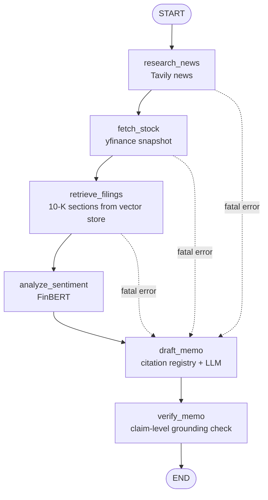
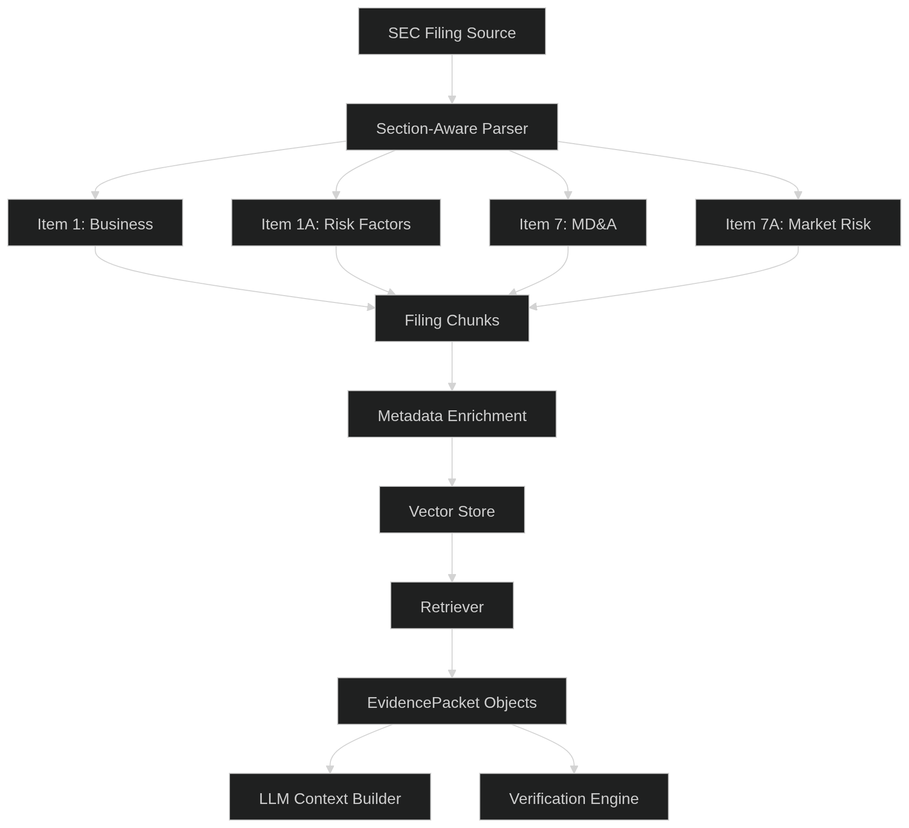
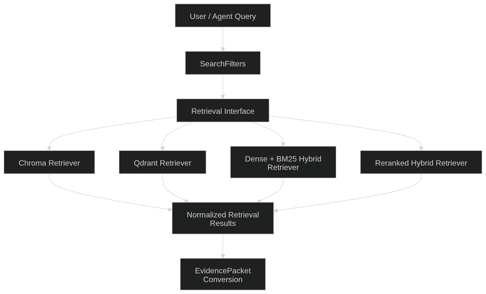
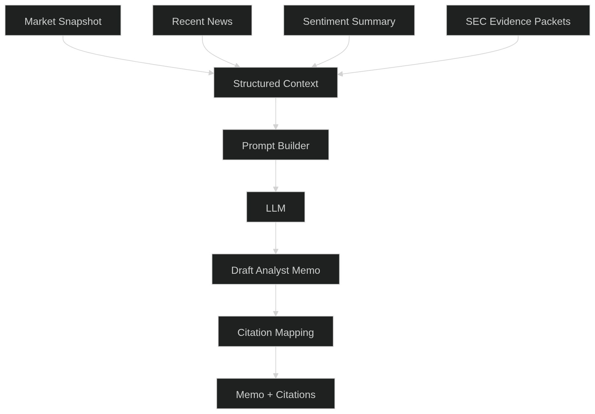
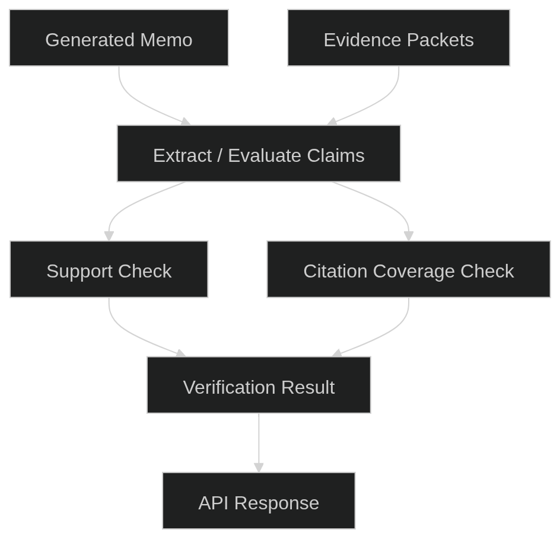
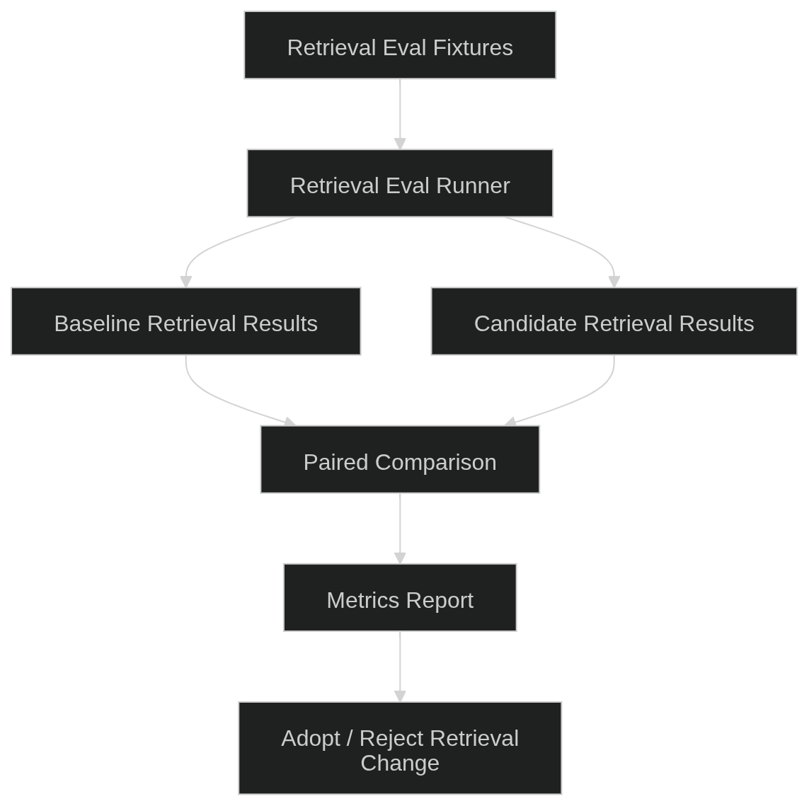
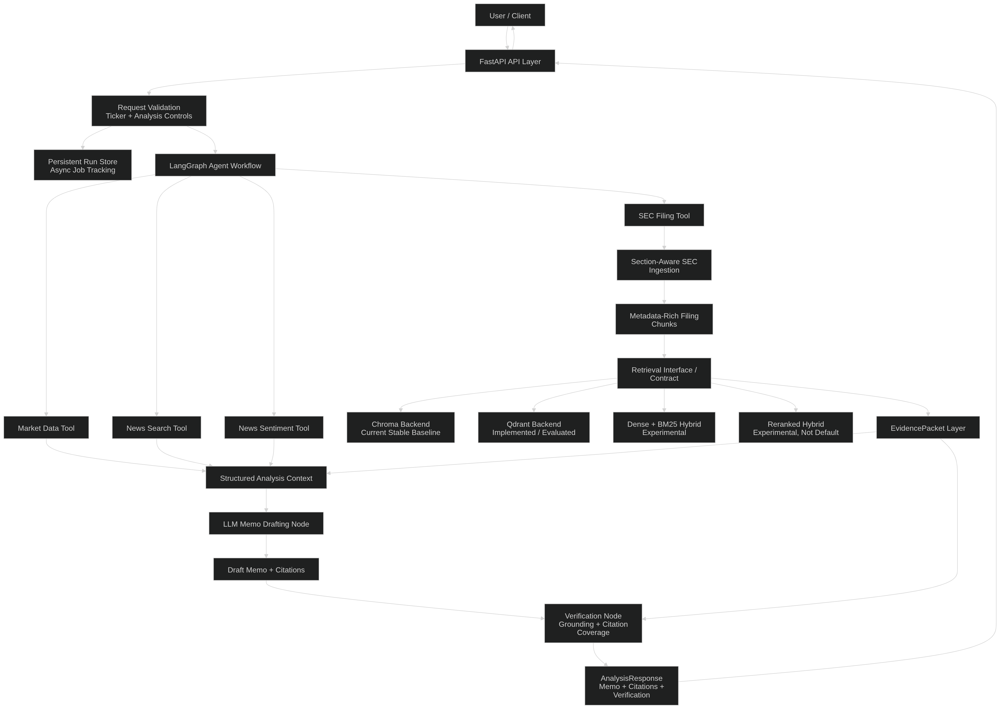
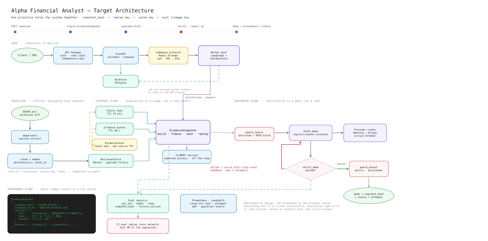

# Financial Analyst Agent

A single-agent financial research system: give it a stock ticker and it gathers market data, recent news and SEC 10-K filing evidence, then writes an investment memo where every factual sentence cites a numbered source. A verifier then checks the memo claim by claim before it is returned.

[](https://www.python.org/downloads/)
[](https://github.com/langchain-ai/langgraph)
[](https://fastapi.tiangolo.com)
[](LICENSE)

**Built with:** LangGraph · FastAPI · Pydantic v2 · Qdrant (Chroma fallback) · Ollama embeddings · Amazon Bedrock or Ollama chat models · FinBERT · edgartools · Tavily · yfinance · Prometheus · LangSmith

### What it does

1. **Collects evidence**: recent news (Tavily), a market snapshot (yfinance) and sections of the company's latest 10-K filing (Business, Risk Factors, MD&A, Market Risk) retrieved from a vector store.
2. **Scores sentiment** on the news with FinBERT.
3. **Builds a citation registry**: every source gets a number *before* the model is called, so the model can only cite sources that exist.
4. **Drafts the memo** in seven fixed sections, from executive summary to recommendation.
5. **Verifies the memo**: it extracts factual claims, matches their numbers within a tolerance and checks semantic similarity (≥ 0.45) against the cited evidence. It reports `citation_coverage_rate`, `grounded_claim_rate` and any citations that point to no source.
6. **Serves it all through a FastAPI service** with synchronous and asynchronous endpoints, health checks, statistics and Prometheus metrics.

### Project status

This is an **instrumented prototype** that is being made production-ready. The evaluation and grounding harness is the most mature part; the service layer is the least. Known gaps, verified against the code:

- An ingestion failure or un-ingested ticker produces a memo without SEC evidence that still reports `completed`.
- Verification results are reported but not enforced, and there is no repair loop.
- Graph nodes run one after another, and FinBERT blocks the event loop.
- There is no authentication, rate limiting, guardrails or caching, and async jobs run in-process.

The ordered plan for closing these gaps is in [`docs/sprint-plan.md`](docs/sprint-plan.md). Scope and source-of-truth rules are in [`docs/SPEC.md`](docs/SPEC.md).

---

## Diagrams

### Agent workflow (current code)

Drawn from `create_agent()` in [`app/agents/graph.py`](app/agents/graph.py). If a node records a fatal error, the graph skips straight to `draft_memo`, and the memo states which data was unavailable. The request's `include_*` options are handled inside the nodes.


```mermaid
flowchart TD
    S([START]) --> N[research_news<br/>Tavily news]
    N --> K[fetch_stock<br/>yfinance snapshot]
    K --> F[retrieve_filings<br/>10-K sections from vector store]
    F --> A[analyze_sentiment<br/>FinBERT]
    A --> D[draft_memo<br/>citation registry + LLM]
    D --> V[verify_memo<br/>claim-level grounding check]
    V --> E([END])
    N -. fatal error .-> D
    K -. fatal error .-> D
    F -. fatal error .-> D
```

### Component diagrams

<details>
<summary><b>Evidence pipeline</b>: how filings, news and market data become citable evidence packets</summary>


</details>

<details>
<summary><b>Retriever architecture</b>: section-aware, hybrid and reranked retrieval behind one store interface</summary>


</details>

<details>
<summary><b>Memo generation</b>: evidence sources merged into a cited memo</summary>


</details>

<details>
<summary><b>Verification flow</b>: claim extraction, number matching and semantic grounding</summary>


</details>

<details>
<summary><b>Evaluation architecture</b>: retrieval benchmarks, quality baselines and LLM-judge metrics</summary>


</details>

<details>
<summary><b>Low-level architecture</b></summary>


</details>

### Target architecture (proposed, not yet implemented)

These diagrams show where the sprint plan is heading: evidence snapshots with replay, a job queue with workers, guardrails, a bounded repair loop and an evaluation registry. They describe a design, not the code as it stands.

| Diagram | Image | Editable source |
|---|---|---|
| High-level design | [`docs/png/hld.png`](docs/png/hld.png) | [`hld.excalidraw`](docs/System-design/hld.excalidraw) |
| System design | [`docs/png/system-design.png`](docs/png/system-design.png) | [`system-design.excalidraw`](docs/System-design/system-design.excalidraw) |
| Low-level design | [`docs/png/lld.png`](docs/png/lld.png) | [`lld.excalidraw`](docs/System-design/lld.excalidraw) |
| Critical request flow | [`docs/png/critical-flow.png`](docs/png/critical-flow.png) | [`critical-flow.excalidraw`](docs/System-design/critical-flow.excalidraw) |

Large-scale variants of the same four diagrams are in [`docs/png/production/`](docs/png/production/), with SVGs in [`docs/svg/production/`](docs/svg/production/). Their sizing figures are projections, not measurements.



---

## Installation Instructions

### Prerequisites

| Requirement | Needed for |
|---|---|
| Python 3.12 and [`uv`](https://docs.astral.sh/uv/) | everything |
| [Ollama](https://ollama.com) with `qwen3-embedding:4b` | embeddings for ingestion and retrieval; optionally the chat model too |
| AWS credentials with Amazon Bedrock access | the default chat-model provider (`LLM_PROVIDER=bedrock`) |
| Docker | Qdrant, and the optional API + Prometheus + Grafana stack |
| Tavily API key | news search |
| An SEC contact string (`Name email@example.com`) | SEC EDGAR access |

The offline unit tests need none of the external services.

### 1. Clone and install

```bash
git clone https://github.com/nilesh-auradkar05/Financial-Analyst-Agent.git
cd Financial-Analyst-Agent
uv python install 3.12
uv sync --python 3.12
```

### 2. Configure the environment

Create a `.env` file in the repository root. Settings are read by [`app/config.py`](app/config.py).

```bash
# Chat model: Bedrock (default) or Ollama
LLM_PROVIDER=bedrock
LLM_MODEL=anthropic.claude-sonnet-4-6
AWS_REGION=us-east-1
LLM_THINKING_MODE=off            # off | enabled | adaptive

# Ollama (embeddings always; chat model when LLM_PROVIDER=ollama)
OLLAMA_BASE_URL=http://localhost:11434
OLLAMA_EMBED_MODEL=qwen3-embedding:4b
OLLAMA_LLM_MODEL=qwen3.5:9b

# Vector store
VECTOR_BACKEND=qdrant            # or chroma
QDRANT_URL=http://localhost:6333

# Evidence sources
TAVILY_API_KEY=tvly-...
SEC_USER_AGENT="Your Name your-email@example.com"
EDGAR_IDENTITY="Your Name your-email@example.com"

# Optional tracing
LANGSMITH_API_KEY=
```

AWS credentials come from the standard AWS chain (environment variables, `~/.aws`, or an instance role). Do not commit `.env`.

### 3. Start the local services

```bash
docker compose -f docker-compose.qdrant.yml up -d   # Qdrant on :6333
ollama pull qwen3-embedding:4b                        # embedding model
```

To skip Qdrant, set `VECTOR_BACKEND=chroma`, which stores data locally on disk.

### 4. Check the install

```bash
uv run pytest tests/unit -q
```

The full setup and test walkthrough, including troubleshooting, is in [`docs/setup-and-test.md`](docs/setup-and-test.md).

---

## Usage

### Run the API

```bash
make serve          # uv run uvicorn app.main:app --reload --host 0.0.0.0 --port 8000
make serve-prod     # 4 workers, no reload
```

Interactive API docs: <http://localhost:8000/docs>

To run the API with Prometheus (`:9090`) and Grafana (`:3000`) in Docker instead:

```bash
make docker-up
make docker-logs
make docker-down
```

### Endpoints

| Method | Endpoint | Purpose |
|---|---|---|
| `GET` | `/` | Service info |
| `GET` | `/health` | Component health |
| `GET` | `/metrics` | Prometheus metrics |
| `GET` | `/stats` | Vector-store and run-store statistics |
| `POST` | `/ingest` | Ingest a company's SEC filing |
| `GET` | `/ingest/{ticker}` | Check whether a ticker is indexed |
| `POST` | `/analyze` | Run an analysis and wait for the memo |
| `POST` | `/analyze/async` | Start an analysis job; returns a `job_id` |
| `GET` | `/jobs/{job_id}` | Poll a job's status and result |

### Typical flow

1. **Ingest** the ticker's 10-K once. Without this step, the memo has no SEC evidence.
2. **Analyze** the ticker, either synchronously or as a job.
3. Read the `verification` block in the response to see how well the memo is grounded.

**Analysis request options** (`POST /analyze`, `POST /analyze/async`):

| Field | Default | Meaning |
|---|---|---|
| `ticker` | required | 1–10 characters, e.g. `AAPL` |
| `company_name` | looked up | Optional override |
| `include_filing_analysis` | `true` | Use SEC filing evidence |
| `include_news_sentiment` | `true` | Run FinBERT on the news |
| `max_news_articles` | `10` | 1–50 |

**Ingestion request options** (`POST /ingest`): `ticker` (required), `filing_type` (default `10-K`), `force_refresh` (default `false`).

### Developer commands

```bash
make test           # full test suite
make lint           # ruff
make typecheck      # mypy
make smoke-test     # live end-to-end pipeline for AAPL (needs all services)
```

---

## Examples / Demos

### Ingest, then analyze

```bash
curl -X POST http://localhost:8000/ingest \
  -H "Content-Type: application/json" \
  -d '{"ticker": "AAPL"}'

curl http://localhost:8000/ingest/AAPL

curl -X POST http://localhost:8000/analyze \
  -H "Content-Type: application/json" \
  -d '{"ticker": "AAPL", "max_news_articles": 5}'
```

### Run it as a background job

```bash
curl -X POST http://localhost:8000/analyze/async \
  -H "Content-Type: application/json" \
  -d '{"ticker": "MSFT", "include_news_sentiment": false}'

curl http://localhost:8000/jobs/<job_id>
```

### Response shape

The response is abridged below; the values are placeholders, not real output. The full schema is `AnalysisResponse` in [`app/models.py`](app/models.py).

```json
{
  "ticker": "AAPL",
  "company_name": "Apple Inc.",
  "status": "completed",
  "executive_summary": "…",
  "investment_memo": "## Executive Summary\n… [1][4] …",
  "stock_data": { "current_price": 0.0, "pe_ratio": 0.0, "sector": "…" },
  "sentiment": { "overall_sentiment": "…", "positive_count": 0, "negative_count": 0 },
  "citations": [
    { "index": 1, "source_type": "sec_filing", "title": "…", "url": "…", "date": "…" }
  ],
  "verification": {
    "passed": true,
    "total_claims": 0,
    "citation_coverage_rate": 0.0,
    "grounded_claim_rate": 0.0,
    "orphan_citations": []
  },
  "errors": [],
  "execution_time_ms": 0.0
}
```

### Measured results

These numbers come from committed artifacts. Each one holds only for the model and inputs listed next to it.

| Measurement | Result | Setup | Source |
|---|---|---|---|
| Grounded-claim rate | **0.935 ± 0.045** | 30 memos (two replay runs of AAPL, MSFT, NVDA × 5), frozen evidence release `alpha-evidence:0.1.0`, `deepseek.v3.2` at temperature 0.3, commit `89265b8` | [`quality_baselines/alpha-quality-baseline__0.1.0.json`](artifacts/dataops/quality_baselines/alpha-quality-baseline__0.1.0.json) |
| Citation coverage | **0.923 ± 0.047** | same run | same file |
| End-to-end latency (warm, sequential) | p50 **32.6 s**, p95 **37.7 s** | 12 warm runs, Ollama `minimax-m3:cloud`, commit `2a47dd1` | [`evaluation/latency_res/`](evaluation/latency_res/) |

### Reproduce the evaluations

```bash
# Memo quality against the frozen evidence release (no live data sources)
uv run python -m evaluation.quality_baseline --evidence-release alpha-evidence:0.1.0

# Sequential latency baseline
uv run python -m evaluation.latency_baseline --tickers AAPL MSFT NVDA --repeats 5

# Run every retrieval method on the shared benchmark, then compare two result files case by case
uv run python -m evaluation.run_shared_retrieval_benchmark --dry-run
uv run python evaluation/compare_retrieval_results.py <baseline.json> <candidate.json> --strict-case-ids
```

Comparisons change one thing at a time: the same fixture, and either the backend or the method, never both. The methodology is in [`docs/retrieval-benchmark.md`](docs/retrieval-benchmark.md).

---

## License

Released under the [MIT License](LICENSE). Copyright (c) 2025 Nilesh Auradkar.

---

## Contributors and contacts

**Nilesh Auradkar**, author and maintainer
- GitHub: [@nilesh-auradkar05](https://github.com/nilesh-auradkar05)
- Email: nilesh.auradkar14@gmail.com

Bug reports and ideas are welcome as [GitHub issues](https://github.com/nilesh-auradkar05/Financial-Analyst-Agent/issues). Before opening a pull request, read [`CLAUDE.md`](CLAUDE.md) / [`AGENTS.md`](AGENTS.md). Every change must trace to the SPEC, include a behavior test from [`docs/test-plan.md`](docs/test-plan.md), and pass the governance checks in `scripts/ci/`.
