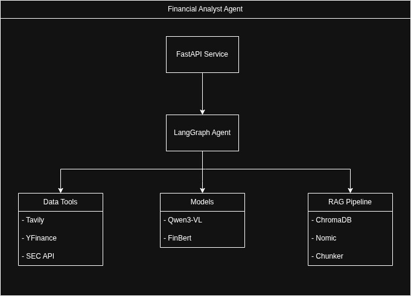
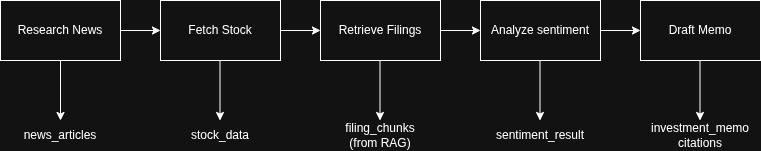

# Financial Analyst Agent System

AI-powered financial analyst agent that researches companies, analyzes SEC filings, evaluates market sentiment, retrieves filing evidence, and generates investment memos with citations.

Built with **LangGraph**, **FastAPI**, **RAG**, **Pydantic**, local-first LLM tooling, and a retrieval evaluation workflow designed for measurable grounding improvements.

[](https://www.python.org/downloads/)
[](https://github.com/langchain-ai/langgraph)
[](https://fastapi.tiangolo.com)
[](https://opensource.org/licenses/MIT)
[](https://github.com/psf/black)

## Project Status

The project is currently in a **retrieval benchmark stabilization sprint**.

Core MVP and production-hardening foundations are complete:

- LangGraph-based single-agent analysis workflow
- FastAPI service endpoints for sync and async analysis
- SEC filing ingestion with section-aware metadata
- normalized evidence packets for grounding and citations
- backend-facing retrieval abstraction
- persistent file-backed async run tracking
- health, stats, metrics, and runtime-hardening endpoints
- retrieval evaluation scaffolding and baseline comparison utilities
- memo verification and citation coverage checks wired into the workflow

Recent retrieval experiments showed that adding hybrid retrieval or reranking did **not** yet produce reliable quality gains. The current priority is therefore not another shiny retrieval trick taped to the side of the system. The current priority is to run every retrieval method against the same shared benchmark fixture and make paired, case-level comparisons.

### Current Sprint Objective

Establish a trustworthy retrieval baseline using:

```text
evaluation/fixtures/retrieval_shared_benchmark_v1.json
```

Every retrieval method should be evaluated against the same case IDs before any method becomes the default.

### Current Decision

Do **not** adopt reranked hybrid retrieval as the default yet.

The corrected paired comparison showed small top-rank gains in some metrics, but weaker recall and section coverage. For this project, evidence coverage matters more than a cosmetic precision bump that quietly drops useful filing context into the void.

## What This System Does

Given a ticker, the system can:

1. fetch market context,
2. collect recent company news,
3. ingest and retrieve SEC filing sections,
4. build structured evidence packets,
5. run sentiment and structured analysis,
6. generate an investment memo with citations,
7. verify memo grounding and citation coverage,
8. expose the workflow through a FastAPI service.

## Features

### Multi-Source Research

- **News search** through Tavily
- **Stock data** through YFinance
- **SEC filings** through EDGAR APIs
- **Filing-section retrieval** for business, risk factors, MD&A, and market-risk sections

### Evidence-Centered RAG

- backend-agnostic retrieval contract
- metadata-rich filing chunks
- section-aware retrieval filters
- normalized `EvidencePacket` objects
- citation-friendly memo generation
- grounding and citation verification

### Evaluation and Observability

- retrieval fixtures and benchmark result files
- paired retrieval comparison tooling
- precision, recall, MRR, NDCG, section-recall, first-rank, and latency-oriented metrics
- health, stats, and metrics endpoints
- LangSmith / RAGAS / DeepEval-oriented evaluation direction

### Service Layer

- FastAPI sync and async analysis endpoints
- file-backed async run state
- graceful handling of partial tool failures
- environment-driven configuration
- Docker/local-stack support

## Architecture



### Agent Workflow



### Architecture at a Glance

```text
Ticker Request
  -> Validate request and runtime configuration
  -> Fetch market data and recent news
  -> Retrieve SEC filing evidence
  -> Build structured evidence packets
  -> Run sentiment and structured analysis
  -> Draft memo with citations
  -> Verify grounding and citation coverage
  -> Return memo, evidence, citations, and verification payload
```

## Repository Layout

```text
Financial-Analyst-Agent/
├── agents/
├── api/
│   ├── main.py
│   ├── run_store.py
│   └── schemas.py
├── configs/
├── evaluation/
│   ├── fixtures/
│   ├── results/
│   └── compare_retrieval_results.py
├── models/
├── monitoring/
├── observability/
├── rag/
│   ├── embeddings.py
│   ├── evidence.py
│   ├── ingestion.py
│   └── vector_store.py
├── scripts/
├── tests/
├── tools/
├── Dockerfile
├── Makefile
├── docker-compose.yml
├── docker-compose.qdrant.yml
└── pyproject.toml
```

## Requirements

- Python 3.12+
- Ollama running locally
- Tavily API key for web/news search
- SEC-compliant user agent string
- local write access for vector-store persistence and file-backed run storage
- Qdrant local stack when running Qdrant-backed retrieval experiments

## Local Setup

### 1. Clone the repository

```bash
git clone https://github.com/nilesh-auradkar05/Financial-Analyst-Agent.git
cd Financial-Analyst-Agent
```

### 2. Install dependencies

```bash
uv install
```

Optional full local setup:

```bash
make install
```

### 3. Pull local models

```bash
ollama pull qwen3-vl:8b
ollama pull qwen3-embedding:4b
```

### 4. Configure environment

Create a `.env` file with at least:

```bash
TAVILY_API_KEY=tvly-xxxxxxxxxxxxx
OLLAMA_BASE_URL=http://localhost:11434
OLLAMA_LLM_MODEL=qwen3-vl:8b
OLLAMA_EMBED_MODEL=qwen3-embedding:4b
SEC_USER_AGENT="your-name your-email@example.com"
CHROMA_PERSIST_DIR=./data/chroma
VECTOR_BACKEND=qdrant
QDRANT_URL=http://localhost:6333
```

Use `VECTOR_BACKEND=chroma` when comparing against the Chroma baseline.

## Running the API

### Development server

```bash
make serve
```

Equivalent direct command:

```bash
uv run uvicorn api.main:app --reload --host 0.0.0.0 --port 8000
```

### Production-style local run

```bash
make serve-prod
```

## Docker and Local Stack

Bring up the default stack:

```bash
make docker-up
```

Bring up Qdrant locally when running Qdrant experiments:

```bash
docker compose -f docker-compose.qdrant.yml up -d
```

Stop services:

```bash
make docker-down
```

View logs:

```bash
make docker-logs
```

## API Reference

### Base URL

```text
http://localhost:8000
```

### Core Endpoints

| Method | Endpoint | Description |
|---|---|---|
| `GET` | `/` | Basic API info |
| `GET` | `/health` | Component health check |
| `GET` | `/metrics` | Prometheus metrics |
| `GET` | `/stats` | Vector store and run-store stats |
| `POST` | `/analyze` | Run synchronous analysis |
| `POST` | `/analyze/async` | Start async analysis job |
| `GET` | `/jobs/{job_id}` | Fetch async job status/result |
| `POST` | `/ingest` | Ingest SEC filing data |
| `GET` | `/ingest/{ticker}` | Check whether a ticker is indexed |
| `GET` | `/docs` | Swagger UI |

## Example Usage

### Ingest a ticker

```bash
curl -X POST http://localhost:8000/ingest \
  -H "Content-Type: application/json" \
  -d '{"ticker": "AAPL"}'
```

### Run synchronous analysis

```bash
curl -X POST http://localhost:8000/analyze \
  -H "Content-Type: application/json" \
  -d '{"ticker": "AAPL"}'
```

### Run async analysis

```bash
curl -X POST http://localhost:8000/analyze/async \
  -H "Content-Type: application/json" \
  -d '{"ticker": "MSFT"}'
```

Then poll:

```bash
curl http://localhost:8000/jobs/<job_id>
```

### Use optional analysis controls

```bash
curl -X POST http://localhost:8000/analyze \
  -H "Content-Type: application/json" \
  -d '{
    "ticker": "AAPL",
    "include_filing_analysis": true,
    "include_news_sentiment": false,
    "max_news_articles": 5
  }'
```

## Retrieval and Ingestion Notes

The retrieval layer is designed around a backend-facing abstraction in `rag/vector_store.py`, not direct ad hoc calls into one database.

Supported retrieval concepts include:

- metadata-rich `IndexDocument` objects
- `SearchFilters` for ticker, filing type, section key/name, and filing date
- section-focused retrieval helpers
- vector-store stats and document counting
- `EvidencePacket` as the atomic retrieval unit for downstream grounding

The ingestion path tracks:

- filing date
- total chunks
- requested sections
- sections found
- sections skipped
- documents written

## Testing

Run focused API and run-store tests:

```bash
uv run pytest tests/test_run_store.py tests/test_api_integration.py
```

Run the full test suite:

```bash
make test
```

Equivalent direct command:

```bash
uv run pytest tests/ -v
```

Run unit tests only:

```bash
uv run pytest tests/unit -v
```

Run integration tests that need external services/API keys:

```bash
uv run pytest tests/integration -v --run-integration
```

## Retrieval Evaluation

The next sprint task is to run every retrieval method against the same shared benchmark fixture:

```bash
uv run python evaluation/retrieval_main.py \
  --fixture evaluation/fixtures/retrieval_shared_benchmark_v1.json \
  --mode section_aware \
  --output evaluation/results/qdrant_section_aware_shared_v1.json
```

Repeat the run for each retrieval mode, then compare paired results:

```bash
uv run python evaluation/compare_retrieval_results.py \
  evaluation/results/qdrant_section_aware_shared_v1.json \
  evaluation/results/qdrant_reranked_hybrid_shared_v1.json \
  --baseline-mode section_aware \
  --candidate-mode reranked_hybrid \
  --candidate-method dense_bm25_cross_encoder_rerank \
  --strict-case-ids
```

Result files should identify their source fixture and retrieval method. Anything less is how fake benchmarks are born, and they grow up to become slide-deck lies.

Expected result metadata:

```json
{
  "fixture_file": "evaluation/fixtures/retrieval_shared_benchmark_v1.json",
  "mode": "section_aware",
  "retrieval_method": "qdrant_section_aware"
}
```

### Retrieval Decision Rules

- Keep the section-aware baseline if hybrid/reranked methods reduce recall or section coverage.
- Do not adopt a method just because precision@5 improves while recall@5 collapses.
- Treat latency, first relevant rank, section recall, and pass@k as first-class metrics.
- Compare only shared `case_id` values with paired deltas.
- Separate retrieval-method improvements from answer-generation prompt improvements.

## Current Sprint Checklist

- [x] Complete MVP hardening baseline
- [x] Add evidence packet schema and citation-grounding path
- [x] Add retrieval abstraction and section-aware ingestion
- [x] Add persistent async run state
- [x] Add baseline retrieval evaluation scaffolding
- [x] Add Qdrant migration/evaluation path
- [x] Create `retrieval_shared_benchmark_v1.json`
- [x] Run all retrieval methods on the shared benchmark fixture
- [x] Compare methods using strict paired `case_id` evaluation
- [x] Select the real retrieval baseline from measured results
- [x] Diagnose section-recall losses before adopting hybrid or reranked retrieval
- [ ] Move to GEPA prompt / agent-answer optimization after retrieval evaluation stabilizes

## Roadmap Direction

### Current Priority

1. stabilize shared retrieval evaluation,
2. run all methods against `retrieval_shared_benchmark_v1.json`,
3. select the measured retrieval baseline,
4. diagnose section-recall loss,
5. only then optimize prompts/agent answers with GEPA.

### Deferred

- broad multi-agent orchestration
- frontend polish
- cloud deployment hardening
- long-term memory
- production queue system
- MCP/A2A/swarm-style agent expansion

These are valid future directions, but they are not the current bottleneck. The current bottleneck is proving retrieval quality with a benchmark that does not lie by accident.

## Recommended Repo Status Statement

> Financial Analyst Agent is a single-agent financial analysis system built around LangGraph, FastAPI, SEC/news/market-data tools, structured evidence packets, verification-aware memo generation, persistent run tracking, and backend-abstracted retrieval. The current sprint is focused on stabilizing retrieval evaluation by running all retrieval methods against `retrieval_shared_benchmark_v1.json` with paired case-level comparison before adopting hybrid/reranked retrieval or moving into GEPA-based prompt optimization.

## License

MIT License.
