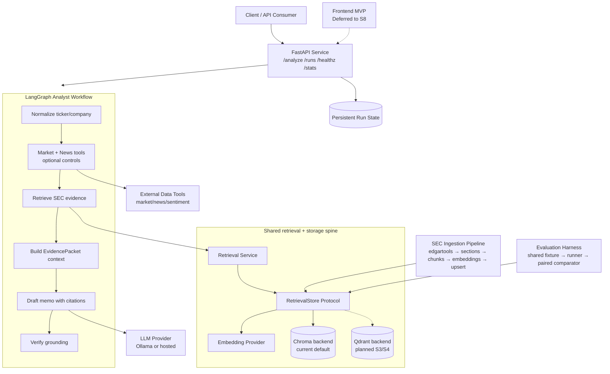

# Alpha Financial Analyst Agent — High-Level Design

**Companion to:** `docs/design-html/alpha-analyst-hld.html`
**Purpose:** AI-readable summary of the HLD visual.

## Summary

Two paths converge on one retrieval/storage spine:

1. **Online runtime path**: client/API → LangGraph workflow → tools/retrieval → evidence context → memo → verification → response.
2. **Offline path**: SEC ingestion writes the index; benchmark/evaluation reads the same index through the retrieval contract.

The key boundary is the `RetrievalStore` interface below `rag/`. If this contract holds, Chroma to Qdrant is a backend swap. If it leaks backend client objects or backend-shaped results upward, the migration becomes surgery. And nobody likes emergency surgery performed by a code agent with a markdown scalpel.

## Mermaid view

## Status encoding from HTML

- Green = claimed complete, but not verified by this review.
- Amber = planned or deferred.
- Violet = storage/state.
- Gray = external dependency.

## Design notes

- The frontend is deferred to S8 and is not a dependency for S0–S4.
- Ingestion must lock stable chunk IDs before benchmark labels are authored.
- Evaluation reads through the same retrieval contract to keep comparisons honest.
- C0–C3 baseline claims remain unverified until S0-T04 records test evidence.
