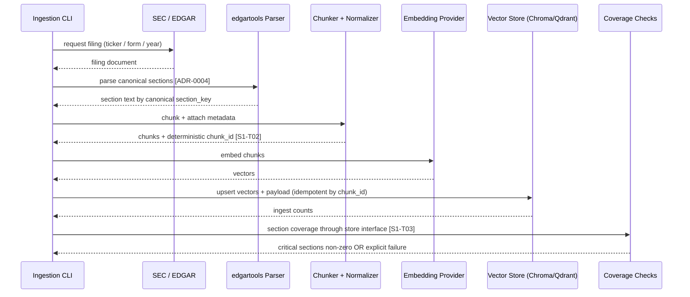

# Alpha Financial Analyst Agent — SEC Ingestion & Indexing Sequence

**Companion to:** `docs/design-html/alpha-analyst-ingestion-sequence.html`
**Purpose:** AI-readable sequence summary for the offline ingestion path.

## Invariant

`chunk_id = f(accession_number, section_key, chunk_index)` is born during chunking. That ID becomes `EvidencePacket.evidence_id`, the benchmark join key, and the memo citation key.

## Mermaid sequence



## Source-section cache

The same parser output also builds:

```text
evaluation/fixtures/source_sections/<accession_number>_<section_key>.txt
```

The S2 fixture validator checks every gold anchor against this cache. This keeps the benchmark grounded in the exact source text the system ingested, which is annoyingly necessary because benchmarks otherwise love becoming fiction.

## Required behavior

- Critical present sections produce >0 chunks through the retrieval store interface.
- Missing optional sections are explicit skip/xfail, not silent pass.
- Re-ingest of the same filing yields identical chunk IDs.
- Metadata is canonical and backend-invariant.
- Qdrant and Chroma receive the same payload semantics.

## Test-plan links

- Ingestion tests: `test-plan.md §3`.
- Retrieval contract tests: `test-plan.md §4`.
- Qdrant backend tests: `test-plan.md §5`.
