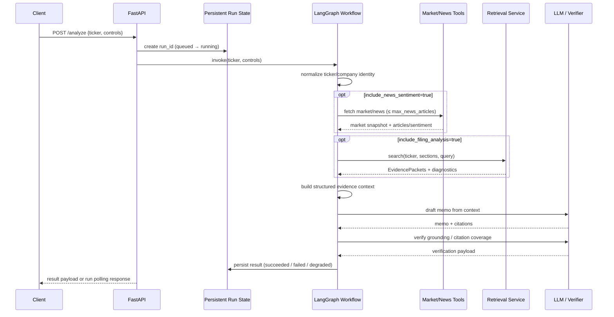

# Alpha Financial Analyst Agent — Runtime Analysis Sequence

**Companion to:** `docs/design-html/alpha-analyst-runtime-sequence.html`
**Purpose:** AI-readable sequence summary for the online path.

## Invariant

Evidence is built before memo generation. Verification runs after generation. Disabled controls are marked disabled; the system does not fake sentiment, SEC citations, or retrieval outputs, because apparently that has to be written down.

## Mermaid sequence

## Required behavior

- `include_filing_analysis=false` means no SEC retrieval and no SEC citations.
- `include_news_sentiment=false` means no news/sentiment step and no fabricated sentiment.
- `max_news_articles` bounds news retrieval.
- Empty retrieval produces an explicit limitation statement.
- Tool or LLM failure persists a safe failed/degraded run.
- Every memo citation resolves to an `evidence_id` in the returned evidence.

## Test-plan links

- API endpoint behavior: `test-plan.md §1`.
- Workflow controls and failure behavior: `test-plan.md §2`.
- Memo/verification grounding: `test-plan.md §7`.
