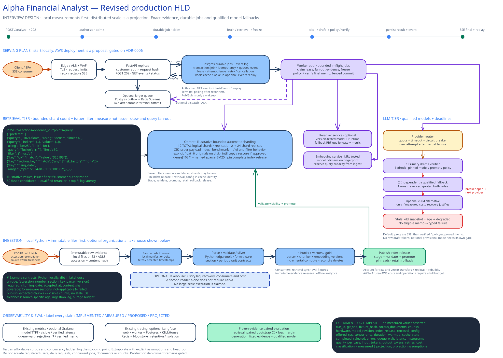
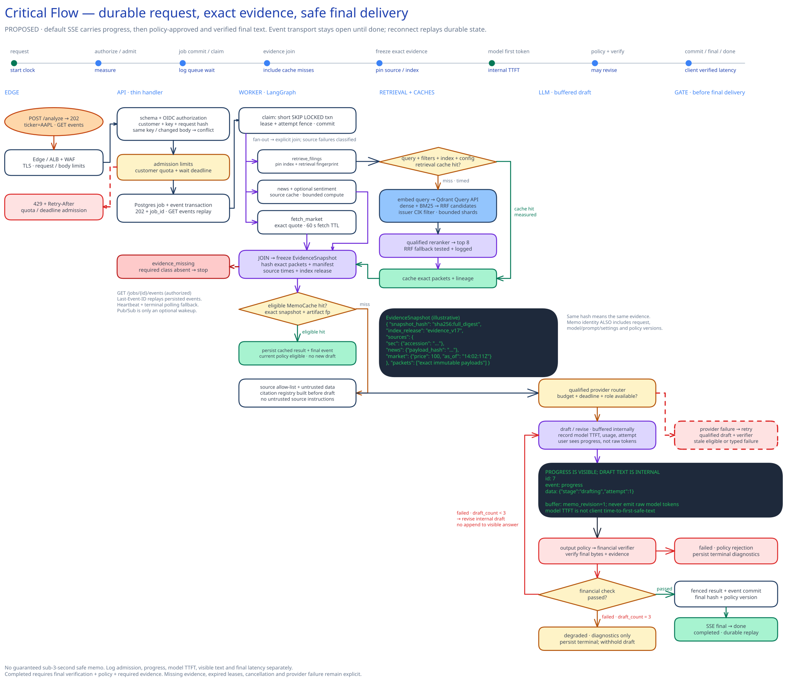
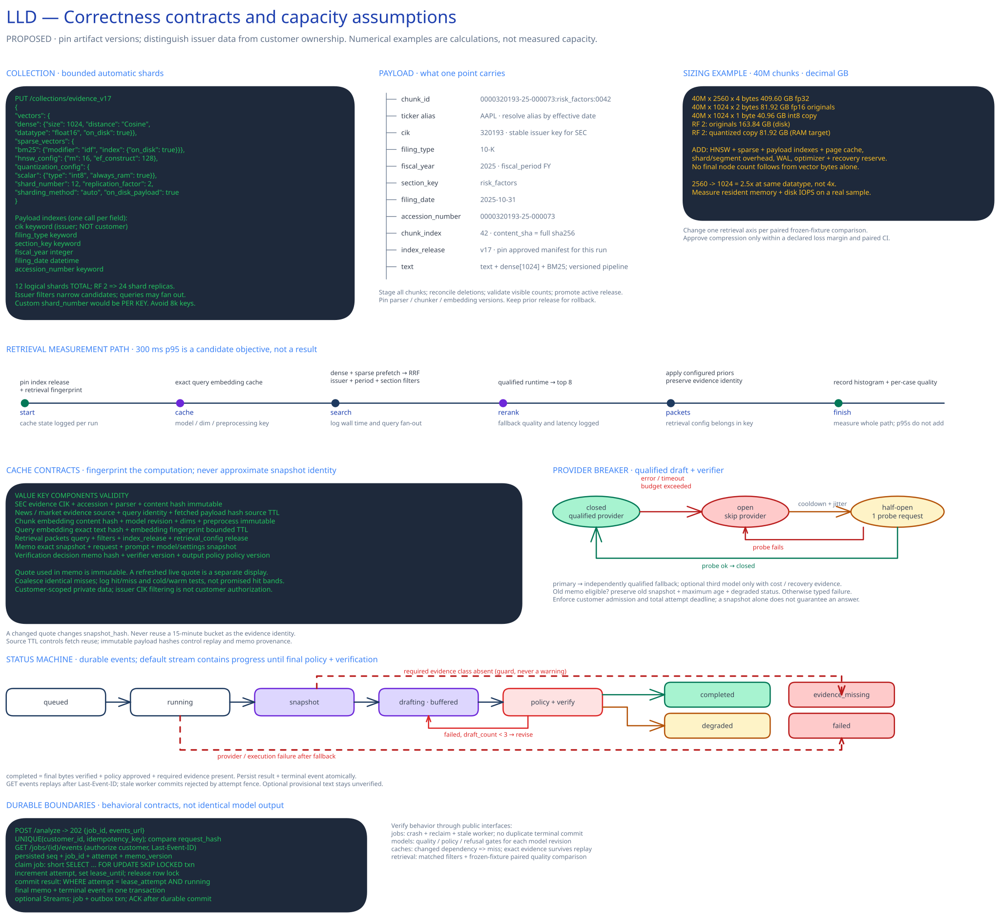
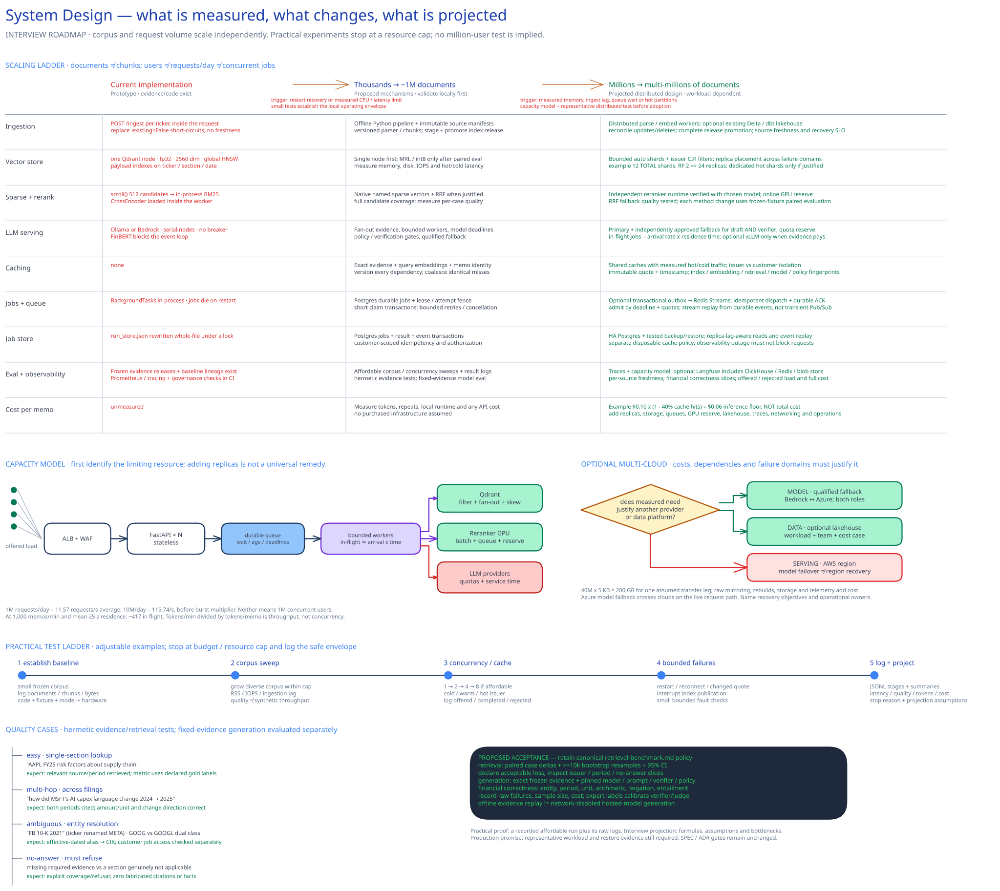

# Production-Scale Design — Interview Companion

**Project:** Alpha Financial Analyst Agent: ticker → SEC, news and market evidence → grounded financial-analysis memo.
**Revised:** 2026-09-06, following the [production design review](production-design-review.md).
**Purpose:** detailed interview answers about scaling documents and requests, supported by affordable experiments on the actual project. Large-scale numbers below are **design projections**, not measured capacity or a commitment to run millions of users.

The questions originate in [production-scale-topic.txt](../production-scale-topic.txt). The proposed decisions are recorded in [ADR-0007](adr/ADR-0007-production-interview-scale-design.md). Canonical [SPEC v1.3](SPEC.md) §0 and §3 govern implementation scope. [ADR-0006](adr/ADR-0006-production-cloud-deployment.md) remains the cloud-deployment gate and is not accepted here. SPEC §12 lists S10 as cloud work still out of committed scope until ADR-0006 (§3.y). This companion does not authorize infrastructure purchases. Scale numbers below are interview projections on a milestone ladder, not a new sprint map.

Read every answer through three distinct labels:

| Label | Meaning |
| --- | --- |
| **Existing** | Capability observed in repository code or a recorded artifact; presence alone does not prove production performance. |
| **Practical next experiment** | A small, bounded test to perform when its implementation task is authorized; log the actual result and limits. |
| **Scale projection** | Architecture, formula or operating hypothesis for an interview scenario; validate before a production commitment. |

No new load, chaos or cloud performance results were produced by this documentation revision. A proposed test below is not a passing test.

## 0. Explain the system and its trust boundary

**Q: What does this project do, and what makes it agentic?**

The single-agent workflow gathers evidence through tools, selects relevant filing passages, constructs a citation registry, drafts a memo and checks the result against the evidence. Its proposed bounded repair loop can revise a failed draft at most twice. Tool use and controlled iteration earn their place through better evidence and measured answer quality; millions of documents do not themselves require multiple agents.

The target request path is: authenticate and admit → obtain SEC, news and market evidence, plus sentiment when requested → join those branches → freeze the exact evidence bundle → build the citation registry → draft → verify financial claims and apply output policy → persist the terminal artifact → deliver it. Missing or failed branches are recorded rather than silently omitted. Required evidence follows request and policy: a source explicitly disabled by the user is not an accidental evidence failure.

**Q: What already exists, and what remains a proposal?**

| Area | Existing, as inspected in the review | Revised target |
| --- | --- | --- |
| Orchestration | LangGraph, evidence tools, retrieval and verification; reviewed evidence routing is serial | Bounded parallel evidence branches, explicit join, deadlines and bounded repair |
| Evidence identity | Immutable source snapshots, release registry and frozen-evidence replay in `dataops/` | Per-run aggregate `snapshot_hash` over exact evidence, source manifest and completeness; retain source identities |
| Evaluation lineage | `evaluation/quality_baseline.py` records git, model/provider, temperature, evaluator settings, evidence release and snapshot IDs | Join request/attempt/artifact lineage; add missing quality gates and performance artifacts |
| CI | Document governance already runs | Explicit retrieval/generation regression gates; do not claim nothing runs in CI |
| Response status | Review found a real gap: a nonempty memo can be marked `completed` despite failed verification | Derive status from final-artifact verification, completeness and policy |
| Retrieval | Qdrant/Chroma boundary, metadata filters, local hybrid/reranking paths | Measured native sparse search, optional separate reranker, controlled index releases |
| Service operations | Instrumented prototype | Durable jobs, authenticated replay, versioned caches and qualified fallback when justified |

These statements refer to the reviewed baseline; the diagrams did not implement these features. Backend clients remain inside the retrieval boundary (`app/components/retrieval/` in the actual layout). Accepted ADR-0003 governs the Qdrant default; inconsistent older README labels do not override it.

**Q: What is the non-negotiable invariant?**

A delivered memo resolves to the exact evidence and final bytes that were checked. Record job, attempt, artifact revision/hash, `snapshot_hash`, evidence/index releases and generation/verifier/policy fingerprints. A snapshot is an identity, not a claim that content is current or the memo is correct. Its hash does not replace access control, financial validation or freshness rules.



The [editable HLD](System-design/production/hld.excalidraw) shows proposed boundaries and optional infrastructure for a larger deployment. Practical work starts with the existing local tools and a small measured workload.

## 1. Document volume: thousands → millions → multi-millions

**Q: What changes as document volume grows?**

Ingestion becomes separately scheduled and restartable. Requests read an approved index release; a user request does not trigger an unbounded SEC backfill. At small scale, Python workers, a manifest and local files/Parquet suffice. At larger scale, object storage, partitioned datasets and distributed parsing/embedding support backfills and incremental updates. Extra vector nodes follow measured storage, indexing and query pressure.

| Corpus scenario | Plausible design | Trigger to consider the next step |
| --- | --- | --- |
| Thousands of documents | Existing Python ingestion, deterministic chunks, local manifests, one vector node | Backfill duration, RAM or recovery exceeds an explicit local budget |
| Millions of documents | Object storage, incremental partitioned processing, bounded embedding workers, vector cluster if necessary | Sustained backlog, imbalance or latency exceeds the agreed envelope |
| Multi-million documents / tens to hundreds of millions of chunks | Parallel backfills, hot/cold retention, versioned publication, tuned storage and capacity isolation | Measurements identify whether ingest, memory, disk, retrieval or recovery saturates |

These are mechanisms, not document thresholds that automatically require Kubernetes, Databricks or Kafka.

**Follow-up: How many vectors does “a million documents” mean?**

Use `chunks = documents × measured mean chunks/document`, retaining the distribution by form. An illustrative 8,000 filers × 12 filings/year × 5 years is **480,000 documents**. Forty million chunks from that population implies **83.3 chunks/document** on average. That is a hypothesis, not a consequence of 1,000-character chunks. At that average, one million documents produces roughly 83 million chunks; 40 million documents is much larger than 40 million vectors.

Annual filings, short 8-Ks, attachments, tables, amendments and duplicates have different distributions. Record median, p95 and maximum chunks/document, document bytes and form mix before extrapolating.

**Follow-up: What does ingestion actually do?**

1. Discover accession, CIK, form and accepted timestamp; apply a compliant shared fetch budget and retry backoff.
2. Store raw bytes, source URL, content hash, accepted/published/fetched times and parser provenance.
3. Parse with Python/edgartools; normalize sections, identity, periods and units; quarantine failures without marking coverage complete.
4. Produce a deterministic chunk manifest. Reuse embeddings only when content **and embedding fingerprint** match; compute pinned sparse encoding separately.
5. Build a staged release, reconcile expected IDs/deletions, validate coverage/retrieval and promote its active pointer.

Delta bronze/silver/gold is an optional larger-scale representation of those stages. dbt can own relational deduplication, contracts, freshness and transforms; Python still owns parsing and inference. Azure Databricks is defensible if the organization already operates it and cost/ownership fits. This project does not assume such a team or platform exists.

**Follow-up: Is 37 GPU-hours for the backfill believable?**

The arithmetic holds **if** embedding achieves 300 chunks/second: `40,000,000 / 300 / 3,600 = 37.0 GPU-hours`. Four perfectly utilized equivalent GPUs give a 9.3-hour embedding-only lower bound. Fetch throttling, parsing, token-length skew, sparse encoding, transfer, index construction, retries and release validation are excluded. The slowest stage limits end-to-end throughput; extra embedding GPUs do not speed up a rate-limited source.

**Follow-up: What about amendments and freshness?**

Track SEC discovery, fetched bytes, parsed coverage and serving visibility separately. A proposed five-minute accepted-to-searchable 8-K target differs from a daily 10-K backfill objective. Choose source-specific targets with the product owner; a generic two/five-day dbt threshold is not every consumer-facing promise. Retain amendment supersession relationships and expose the selected “as of” view. Measure accepted-to-serving and discovery-to-serving lag to distinguish upstream delay from internal delay.

**Follow-up: How do you prevent half a filing becoming searchable?**

A version bump after in-place upserts is insufficient. Build an isolated release (initially a staging collection), reconcile its manifest and tombstones, validate it and atomically update the authoritative active-release pointer. Each request resolves that pointer once and queries the concrete release throughout its lifetime. Retain the prior release for in-flight work and rollback. Promotion waits for the required replicas to contain validated data; replication count alone does not establish read visibility. If the pinned release is unavailable, retry it within deadline or fail explicitly; never mix releases silently.

At scale, full copies may be expensive. Immutable segments/partitions with a pinned manifest can reduce copying but add a protocol that needs demonstrated justification. Re-parsing into fewer chunks removes obsolete IDs from the new release; historical releases retain their evidence under the retention policy.

**Practical next experiment:** ingest an affordable stratified sample; interrupt parsing/publication, rerun the same manifest and reparse one filing into fewer chunks. Log documents/second, chunks/second, timings, coverage, duplicates, RSS and release visibility. A 40-million-chunk rehearsal is not required for the portfolio.

## 2. Query volume: users, requests, throughput and concurrency

**Q: How would you handle thousands or millions of users?**

First ask for requests per active user, daily activity, burst shape, deadlines and cache behavior. Registered users do not consume one worker each. Separate API connections, queued jobs, executing jobs and provider requests. Admission protects downstream budgets; replicas then scale the measured bottleneck.

| Interview workload | Correct interpretation |
| --- | --- |
| 1 million requests/day | `1,000,000 / 86,400 = 11.57` requests/second average |
| 10 million requests/day | `115.74` requests/second average |
| 1,000 memos/minute | `16.67` memos/second; at 25-second mean residence time, roughly **417 jobs in flight** |
| 1,000 executing jobs, 25-second mean service time | Roughly `40` completions/second under stable, fully supplied conditions |
| 1 million registered users | No throughput number without activity/arrival assumptions |

Little’s Law is `mean in-flight = admitted arrival rate × mean residence time`. If residence includes queueing, the result includes queued jobs; use execution time when sizing active work. Means give a planning relationship, not a p95 guarantee. Earnings bursts may greatly exceed the daily average; label assumed burst multipliers explicitly.

**Follow-up: How do model quotas constrain capacity?**

`TPM / tokens per memo` gives **memos/minute**, not concurrency. Plan draft/verifier calls separately, including input/output limits, requests/minute, repairs, fallback reserve and provider-specific accounting. At 1,000 memos/minute, illustrative 8,000-input/2,000-output drafts use 8 million input and 2 million output tokens/minute before verification and repair. A quota does not guarantee tokens arrive quickly enough for an SLO.

Use observed service time plus throughput limits to choose worker concurrency. Extra workers beyond quota create contention and retries. Maintain customer admission budgets, global provider budgets and reserved interactive capacity. Backfill embeddings must not monopolize user query-embedding GPUs.

**Follow-up: What is the smallest durable job design?**

Postgres is the initial authoritative job store and durable queue. In one transaction, validate the authenticated request, reserve a customer-scoped idempotency key against its normalized request hash and insert the queued job. Workers atomically claim with a lease and monotonically increasing attempt/fencing token. Heartbeats renew ownership. Terminal writes require the current attempt; result and terminal event persist together.

Expired leases permit bounded redelivery. A finite retry budget and deadline lead to typed terminal failure when exhausted. Cancellation is authenticated, durable and checked between stages. Cancelling after a provider accepted a call cannot promise a billing refund.

**Follow-up: What if a worker crashes during a paid model call?**

Resume from a durable stage result if available. If the provider accepted a call but no result persisted, its outcome may be unknown. Use provider idempotency/result retrieval where actually supported; otherwise record possible duplicate spend and bound retries. Fencing prevents an old worker overwriting the winner; it does **not** provide exactly-once external model execution or billing.

**Follow-up: When would Streams or Kafka enter?**

If Postgres claim throughput/wakeup latency becomes a measured constraint, write job and outbox rows in one transaction and dispatch to Redis Streams. Dispatch can duplicate, so workers remain idempotent/fenced; acknowledge after the durable outcome commits. Specify pending-entry recovery, bounded retries and dead-letter behavior. Redis Pub/Sub may provide wakeups but never authoritative records.

Evaluate Kafka/Event Hubs for required retention, replay volume, ordered partitions, independent consumers or operational throughput. A second consumer alone is insufficient reason for a new broker. Delta supports batch replay; it does not automatically provide a streaming bus’s latency/delivery semantics.

**Follow-up: How do you shed load fairly?**

Bound queue size and oldest-job age. Reject before acceptance with `429` and meaningful `Retry-After` when quota/admission limits are reached. An accepted job remains durably discoverable until it completes, expires, is cancelled or fails. Apply customer fairness and concurrency/token limits. Public evidence for a hot issuer may be shared, but one customer cannot consume everyone’s allowance. Report offered, admitted, rejected and completed rates together.

**Practical next experiment:** start concurrency 1 → 2 → 4 if resources/spend permit. Use provider stand-ins for crash-boundary tests and a small separately labeled live-provider sample. Kill a worker after claim/result persistence, reuse/conflict an idempotency key and prove only the current attempt commits.

## 3. Latency and safe streaming

**Q: Can you provide sub-three-second p95 latency?**

Define the metric first. A long verified memo can offer fast progress while taking longer to finish. Sub-three-second first display is an **aspiration under a specified cache/load/provider condition**, not an established SLO.

| Metric | Start → end | Meaning |
| --- | --- | --- |
| Admission | Client POST start → 202/typed rejection | Time to accept/refuse work |
| Provider model TTFT | Model request sent → first provider token | Model responsiveness only |
| Client first progress | Client POST start → first progress event received | Job-interface responsiveness |
| Client first displayed memo text | Client POST start → first permitted memo text rendered | User-visible text latency; null when no text is delivered |
| Verified completion | Client POST start → terminal approved/degraded/failure outcome received | End-to-end outcome, including queue and verification |

The critical path includes queue wait, sources, sentiment when requested, GPU/embedding waits, retrieval, draft, verifier, policy, repair and network delivery. Parallel evidence contributes its slowest branch plus join overhead. Adding component p95s does not derive overall p95; measure the end-to-end distribution.

**Follow-up: Do you stream raw drafts to achieve the number?**

The **default streams progress only**, then emits the memo after final verification and output-policy approval. If financial verification remains unsuccessful after the bounded repair budget, emit terminal `degraded` diagnostics and withhold the substantive unapproved draft. An eligible cached artifact may arrive quickly; a cold draft may not. Do not promise safe text in three seconds by moving its safety gate after delivery.

Optional provisional mode requires separate product approval: buffer complete sentences/sections, run mandatory pre-exposure policy, label displayed drafts unverified and identify the revision. It cannot guarantee factual correctness before final verification. Revisions replace earlier artifacts rather than append a second answer. Delivered content cannot be retracted from the reader’s memory; retain progress-only mode where that risk is unacceptable.

**Follow-up: What is the HTTP/SSE contract?**

`POST /analyze` returns `202`, `job_id` and an events URL. The client opens authenticated `GET /jobs/{job_id}/events`; `GET /jobs/{job_id}` reconciles durable status/result. Authorize every read against ownership/entitlements. Use secure same-origin session cookies or an authenticated streaming client; do not put bearer credentials in URLs or assume browser EventSource supports arbitrary auth headers.

Persist ordered event IDs per job and replay after `Last-Event-ID`. Heartbeats are not completion. Persist terminal event and result before optional wakeup, so completion before subscription remains discoverable. Close the transport after terminal delivery; provider token-stream completion is a different event. Sticky sessions are unnecessary for correctness because another replica can replay durable state. Pub/Sub alone loses messages. [Redis Pub/Sub documentation](https://redis.io/docs/latest/develop/pubsub/).

Define retention and maximum stream duration. If a cursor predates retention, return a resynchronization response pointing to durable job state. Terminal retention follows the product’s result policy and can exceed progress retention. Disconnect closes the connection, not the job; explicit authenticated cancellation stops future stages within its limits.

**Follow-up: What is in a terminal event?**

Job ID, sequence, status, attempt, artifact revision/hash or null, snapshot identity or null, verification/policy versions, evidence timestamp, degraded reasons and result URL. Verification describes the final bytes; material policy edits require reverification. Progress contains no draft text and never falsely claims completion.

**Follow-up: Is a 300 ms retrieval budget useful?**

As a provisional component target. Measure cache, query embedding, search, reranker queue/compute and assembly, including misses/timeouts. The old 185 ms sum and 115 ms slack were hypotheses, not measured headroom. Report cold/warm distributions, corpus/filtered size and concurrency before calling the budget achieved.



**Practical next experiment:** record the five clocks for cold/warm requests; reconnect before/after a fast cache hit; interrupt an API replica; block prohibited output before memo delivery; replay the terminal event. Small samples expose protocol defects but cannot establish robust p99 claims.

## 4. Cost: development effort, inference and total service cost

**Q: How do you keep the system economical?**

Start with the smallest working deployment and record cost by request/stage/attempt. Cache exact reusable artifacts, reduce avoidable tokens, cap repairs, qualify cheaper models and batch offline work. Infrastructure follows demand or recovery requirements. Provider spend may dominate high traffic; idle infrastructure and engineering time may dominate this portfolio.

**Follow-up: What is the correct cache-cost calculation?**

`Expected variable cost/request = (1 − hit_rate) × miss_cost + hit_rate × hit_cost`. Illustrative $0.10 misses, 40% hits and zero hit cost give **$0.06/request**, before infrastructure. Actual hits incur storage/network/validation; misses include verifier/retry cost. These are arithmetic examples, not current vendor quotes.

`Fully loaded cost per successful verified memo = all attributable service cost / successful verified memos`. Include failures/abandonment, uncertain duplicate calls, fallback reservation, ingestion amortization, storage/IO, backups, databases, caches, observability, egress and explicit operations allocation. Report degraded outcomes separately; cheap stale responses must not disguise reduced verified availability.

**Follow-up: Which levers come first?**

Exact memo reuse helps where snapshots/request semantics truly repeat; measure it. Tune context selection/output length without deleting needed evidence. Qualify smaller verifier/draft models against material financial errors. Dimension reduction/quantization address retrieval cost separately. Spot/batch GPUs fit restartable backfill; interactive reranking needs an eviction/latency plan.

Permanent vLLM fallback is optional. Compare measured utilization and cost per successful memo with hosted fallback, including idle reserve and operational burden. No invented utilization threshold automatically proves a GPU fleet cheaper.

**Follow-up: How much do dimension reduction and precision save?**

At equal precision, 2,560 → 1,024 dimensions is **2.5× smaller**, a 60% reduction. fp32 → fp16 halves original bytes; int8 is another representation with savings dependent on the comparison. Do not multiply incompatible advertised factors. Evaluate quality separately for each change.

**Practical next experiment:** set USD/token limits before a small live run. Log usage including verification/retries, pricing version and unknown costs. Report marginal/allocation costs separately; do not claim fully loaded cost without allocation data. Stop at the budget rather than purchasing enough traffic for a desired chart.

## 5. Metadata, issuer identity and customer authorization

**Q: Why is metadata central to retrieval at scale?**

Typical research asks about an issuer, time range and sections. Indexed filters remove irrelevant candidates before final ranking. Use stable issuer identity, canonical sections, accession, form and dates. Historical/cross-issuer comparisons need explicit semantics rather than a claim that all queries always touch one fixed-size graph.

**Follow-up: Is ticker a tenant key?**

No. Use CIK as stable SEC issuer identity where applicable; resolve ticker aliases/share classes with effective dates. Customer identity separately controls authorization and billing. Public SEC evidence can be shared subject to entitlements; private prompts, jobs, events, results and traces stay customer-scoped. A Qdrant tenant-style index optimizes search; it does not enforce application authorization.

**Follow-up: Which fields/indexes are useful?**

Proposed payload: canonical `chunk_id`, CIK, useful ticker aliases, accession, form, `section_key`, fiscal period/year, accepted/filing dates, chunk index, content hash, parser/chunker fingerprint and release identity. Index actual filter fields: CIK, section, form, accession and time/period as needed. Every index consumes memory and ingest work; text/payload storage is explicit. Existing ticker/section/date indexes are a starting point.

Resolve identity and apply access restrictions server-side. If private documents enter an explicitly approved future scope, apply entitlements to every retrieval branch and cache lookup. User filters cannot override authorization.

**Follow-up: Shard by company or year?**

Begin with bounded automatic shards plus indexed issuer filters. Illustrative **12 total logical shards × replication 2 = 24 shard replicas**. Automatic sharding can fan queries across shards; filters narrow local work but do not guarantee one shard/request. Year partitions can simplify retention but complicate multi-year issuer comparisons. Custom dedicated shards are an optional response to measured hot/large issuers, with explicit placement/fan-out accounting.

In Qdrant custom sharding, `shard_number` applies per shard key. Twelve per each of 8,000 issuer keys with replication two creates **192,000 shard replicas**. That was the rejected original design. [Qdrant distributed deployment](https://qdrant.tech/documentation/scaling/distributed_deployment/).

**Follow-up: Is filtered latency independent of corpus size?**

No. Filtering helps selectivity, but fan-out, issuer skew, HNSW structure, page cache, storage contention and ingestion still matter. Evaluate tenant-optimized HNSW on a pinned version; do not disable the global graph by default from an unmeasured assumption about all access paths.

**Practical next experiment:** test renamed/share-class symbols, wrong-customer job/events and hot issuers. Log filtered population, actual fan-out, correctness and latency. Compare indexed filters under an unchanged quality oracle.

## 6. Vector storage, HNSW and memory growth

**Q: How do you fit tens or hundreds of millions of vectors?**

Separate originals, quantized vectors, HNSW, payload/sparse indexes and operational working memory. Place originals on disk when rescore latency permits; evaluate lower dimensions/quantization on the fixed benchmark. Measure resident memory during queries, ingestion, compaction and recovery before choosing machines.

| 40-million-vector illustration, decimal GB | Calculation | Meaning |
| --- | --- | --- |
| 2,560-dimension fp32 originals | `40M × 2560 × 4 = 409.60 GB` | Before indexes/replication |
| 1,024-dimension fp32 originals | `163.84 GB` | Default original precision unless changed |
| 1,024-dimension fp16 originals | `81.92 GB` | Explicit supported float16 configuration required |
| 1,024-dimension int8 copy | `40.96 GB` | Excludes representation overhead |
| HNSW at assumed 150 bytes/vector | `6.00 GB` | Illustrative; measure actual layout |
| Payload/index assumption | `8.00 GB` | Placeholder, particularly uncertain for text/sparse indexes |
| Int8 + those graph/payload assumptions, replication 2 | `(40.96 + 6 + 8) × 2 = 109.92 GB` | Partial cluster RAM estimate, not node sizing |

Fp16 disk originals become 163.84 GB with two copies before other data. RAM exclusions include page cache, sparse structures outside the placeholder, WAL, optimizer peaks, shard overhead, node-loss/rebuild and staging-release headroom. Four 64 GB nodes are a hypothesis, not an approved bill of materials. Do not mix decimal GB and GiB.

**Follow-up: What would a candidate configuration look like?**

This is an illustrative target for a pinned, tested Qdrant version, not a deployment. Use a small shard count for local tests; twelve is only the larger scenario’s bounded example.

```json
{
  "vectors": {
    "dense": {
      "size": 1024,
      "distance": "Cosine",
      "datatype": "float16",
      "on_disk": true
    }
  },
  "sparse_vectors": {
    "bm25": {"modifier": "idf", "index": {"on_disk": true}}
  },
  "hnsw_config": {"m": 16, "ef_construct": 128},
  "quantization_config": {
    "scalar": {"type": "int8", "quantile": 0.99, "always_ram": true}
  },
  "sharding_method": "auto",
  "shard_number": 12,
  "replication_factor": 2
}
```

Quantization does not change original precision automatically; specify `datatype`. [Qdrant datatypes](https://qdrant.tech/documentation/manage-data/vectors/). The model/revision must support chosen dimensions/normalization. Qwen3-Embedding-4B supports Matryoshka representation, but project quality still needs measurement. [Model card](https://huggingface.co/Qwen/Qwen3-Embedding-4B).

**Follow-up: What changes at 100 million vectors?**

At 1,024 dimensions, int8 alone is 102.4 GB before replication. Consider hot/cold placement, lower dimensions, disk indexes and additional nodes from measurements. Binary quantization can lose recall; rescore and candidate expansion cost matter. More HNSW `m` spends graph memory/indexing cost; higher search `ef` spends query work for recall. Tune one factor at a time. More shards add network/operational overhead and are not free latency improvement.

**Practical next experiment:** measure bytes/vector and peak RSS on representative affordable text. Sweep a few justified graph/search/quantization choices with the same fixture/method. Extrapolate raw vector bytes algebraically; label nonlinear index/recovery costs unmeasured.



## 7. Hybrid retrieval and reranking

**Q: Why combine dense and lexical search?**

Dense handles paraphrase; lexical handles accession numbers, names, accounting terms and exact item labels. The candidate target stores dense and pinned sparse encoding in Qdrant, searches both under the same filters, combines with reciprocal-rank fusion (RRF), then optionally reranks a bounded set. Server-side fusion avoids copying a large candidate population to each worker.

The reviewed prototype caps `scroll()` at 512 and rebuilds BM25 per query. It does not necessarily scan millions of vectors. Its weaknesses are sparse coverage beyond that cap and repeated construction; native sparse indexing addresses those specific problems.

**Follow-up: Is ANN always appropriate?**

ANN trades exactness for search cost. Selective issuer filters can leave small enough populations for competitive exact search. Measure recall/latency at actual filtered size. Record dense/sparse limits, fusion and final context size in the retrieval fingerprint. Examples such as 40 candidates/branch and 8 final passages are tuning hypotheses.

**Follow-up: Can Qwen3-Reranker simply run on TEI?**

Embedding support does not prove reranker support. The original Qwen3-Reranker-0.6B + TEI pairing was unproven: its artifact declares a causal-LM architecture, and support depends on runtime version. Select a version-tested supported runtime and validate scoring prompt, request shape, truncation, ranking and batching. An existing supported in-process path is sufficient locally. [TEI support](https://huggingface.co/docs/text-embeddings-inference/supported_models), [Qwen configuration](https://huggingface.co/Qwen/Qwen3-Reranker-0.6B/raw/main/config.json).

**Follow-up: What if the reranker times out?**

A separate service isolates GPU memory/batching at larger volume. Fall back to RRF only if independently approved for the applicable quality threshold. Record effective mode/degraded reason; insufficient evidence produces a typed missing-evidence/failure outcome. “Fail open” cannot silently waive evidence requirements. Reserve interactive capacity separately from backfill.

**Follow-up: How do you adopt a better method?**

Follow [retrieval-benchmark.md](retrieval-benchmark.md): same fixtures/case IDs/frozen evidence; change **backend or method**, never both; paired deltas, win/tie/loss, slices and 95% bootstrap confidence intervals with at least 10,000 resamples. Predeclare acceptable loss; inspect recall/section coverage as well as precision/NDCG and retain a holdout. Report latency separately. “Within 2σ” is not an alternative retrieval acceptance rule.

**Practical next experiment:** compare section-aware, hybrid and reranked methods in separate comparisons on the same approved affordable fixture. Measure sparse coverage, recall@k, NDCG@k, section recall, candidate counts and queue/service timings. Do not create gold labels by copying model outputs or against unstable chunk IDs.

## 8. Multi-layer caching and exact evidence identity

**Q: Which caches fit research rather than repeated FAQ?**

Research reuses documents, templates and embeddings even when questions differ. Start with exact caches and measure usefulness. Semantic answer reuse across snapshots can return financially stale text with misleading provenance and is excluded.

Each fingerprint digests a canonical manifest with inspectable component versions. TTL controls reuse eligibility, not content identity.

| Artifact | Key inputs | Validity |
| --- | --- | --- |
| Chunk embedding | Content hash + model/revision, dimension, normalization/preprocessing fingerprint | Same representation only; bounded retention |
| Query embedding | Exact normalized query + embedding fingerprint including instruction/template | Miss on model/dimension/template change; exact reuse first |
| Parsed SEC evidence | CIK/accession + raw hash + parser/chunker fingerprint | Immutable parsed version; latest-accession pointer expires separately |
| News | Provider/source + exact response/content manifest + fetch time | Fetch TTL may coalesce; frozen bundle retains exact articles/timestamps |
| Market | Instrument/provider + exact quote payload + source/fetch times | Candidate 60-second fetch eligibility; changed quote means new snapshot |
| Retrieval | Query + canonical filters/entitlements + release + embedding/sparse/fusion/reranker/prior config | Miss on relevant method/release changes; record effective fallback mode |
| Memo | Private customer scope + normalized request/options + exact snapshot + generation fingerprint | Same evidence and generation contract only |
| Verified delivery eligibility | Artifact hash + verifier/policy fingerprints + current freshness/entitlements | New rules require revalidation; old approval cannot authorize new policy |

**Follow-up: Why remove the 15-minute quote bucket?**

Quotes within the same bucket can differ materially. A memo generated with $100 retains that exact quote/time; it cannot acquire a fresh $90 quote under the same identity. A separate latest-quote UI may sit outside the artifact, explicitly not evidence used in the memo. Changed hashed evidence creates a new identity. Lower hits are an honest consequence of freshness.

**Follow-up: Can near-identical queries share embeddings?**

Begin exact. Negation, year and units can change meaning despite high similarity. A semantic lookup may require computing the new embedding just to locate the cached one, losing the saving. Add it only for a measured safe use case with explicit lookup cost and quality evidence.

**Follow-up: How do you prevent cache stampedes?**

Coalesce in-flight work under its complete artifact key with a short lease/fencing mechanism. Waiters have deadlines and observe durable results; they recover after lease expiry. Customer-private prompts/results are not shared merely because evidence matches. Provider caching, if used, is separately measured and does not weaken identity.

**Follow-up: What hit rate should you claim?**

None before measurement. Report hits and eligible-lookup denominators, age, bytes, eviction/invalidation and saved work by layer and hot/tail workload. A 90% embedding hit rate is not 90% memo reuse. Alert from an observed baseline and user/cost impact, not invented 70–90% bands.

**Practical next experiment:** identical requests, two changed quotes within a bucket, new model/dimension, new index release, stricter policy and simultaneous misses. Check hits/misses and hashes. A few paid cases establish semantics; synthetic lookup traces can study cache behavior cheaply.

## 9. Monitoring, evaluation and financial correctness

**Q: How do you know it is fast, useful and correct?**

Measure separately. Retrieval relevance does not prove financial correctness; satisfaction does not prove a number; cheap responses can fail. Join traces/artifacts by request/job/attempt and evidence identities. Keep high-cardinality customer IDs, hashes and prompts out of Prometheus labels.

| Plane | Metrics/evidence |
| --- | --- |
| Retrieval | Recall@k, precision@k, NDCG@k, section recall, filters/candidates, paired slices |
| Generation | Entailment, correct citation coverage, material-error false acceptance, supported opinion and refusal coverage |
| Agent | Tool outcomes, missing evidence, repair/attempt count, deadlines, fallback/terminal status |
| Performance | Offered/admitted/rejected/completed rates, stage clocks, model TTFT, client display/completion, CPU/RSS/GPU/IO, queue age |
| Economics | Tokens/cost per provider/stage/attempt, all-request spend and fully loaded successful-verified-memo cost |
| User | Citation inspection, usefulness, corrections and abandonment; account for selection bias/privacy |

Existing Prometheus/tracing are the practical start. Langfuse is optional, not merely another schema on RDS. Self-hosted v3 includes web/worker, Postgres, ClickHouse, Redis and blob storage; account for retention, backup and failure isolation. [Langfuse architecture](https://langfuse.com/self-hosting/upgrade/upgrade-guides/upgrade-v2-to-v3). Trace outage must not block delivery; bounded buffering/drop accounting prevents unbounded memory use.

**Follow-up: Are citations and similarity enough?**

No. A claim can reuse correct numbers but reverse direction or confuse periods/units. Check entity, fiscal period, currency, scale, accounting concept, arithmetic and entailment. Distinguish revenue/income, millions/billions, yearly/quarterly changes, and facts/supported interpretation. Arithmetic tolerances reflect source rounding. Citations identify evidence to inspect, not automatic correctness.

Use expert-adjudicated material-error cases and measure **false acceptance of incorrect claims**. Judge/verifier agreement including Cohen’s κ aids calibration, but both can share blind spots. Record prevalence, sample count and disagreements; one κ threshold cannot prove safety.

**Follow-up: What belongs in the golden set?**

| Class | Example | Expected behavior |
| --- | --- | --- |
| Easy | Known filing’s supply-chain risk | Relevant section, faithful cited summary |
| Multi-hop | Compare capex across fiscal years | Evidence for both periods, consistent units and supported comparison |
| Ambiguous | Historical FB/META or GOOG/GOOGL | Effective-date CIK resolution or clarification |
| No answer | Required filing not ingested | Explicit missing evidence; no invented citations |
| Not applicable | Form legitimately lacks a section | Explain applicability, distinguish parse failure |
| Financial adversarial | Reversed growth, wrong scale/period/entity | Reject/repair material error |
| Operational/policy | Stale quote, malicious source instruction, interrupted fallback | Preserve provenance, ignore untrusted instructions and enforce policy/status |

Do not present perfect recall as measured before running the cases. The expected behavior is the oracle; execution reveals compliance.

**Follow-up: How is hosted generation evaluated offline?**

Separate three modes. Hermetic evidence/retrieval replay uses pinned local artifacts with network disabled. Fixed-evidence **hosted generation** freezes tools but still calls Bedrock/Azure and logs usage. Truly offline generation needs pinned local weights/runtime and compute. Replaying old text evaluates a changed verifier/policy, not a new generation prompt.

The repository already has snapshots, release replay and baseline lineage; extend them. The aggregate run snapshot/request lineage adds a contract rather than inventing the first identity. Existing CI governance is not an implemented generation-quality replay gate.

**Follow-up: How do gates avoid statistical hand-waving?**

Retrieval uses the canonical paired bootstrap policy. For the test-plan’s existing generation 2σ proposal, define repeated-generation variation, sample count, baseline, aggregation and uncertainty before implementing a gate. Across-case standard deviation is not permission for arbitrary loss. Report difficult slices and material errors separately; good means must not hide fabricated no-answer responses. New executable cases/gates still need test-plan/task trace.

## 10. Affordable performance experiments and exact logging

**Q: What will you actually test?**

Test and log each layer at the largest **affordable, useful** size, then distinguish observation from projection. Thousands of users, millions of documents and multi-day cloud soaks are not prerequisites for sound interview reasoning. Reproducible evidence is required for claims about actual project performance.

| Level | Bounded experiment | Can establish | Cannot establish |
| --- | --- | --- | --- |
| A — component | Representative sample, one process, stage timings | Local cost/correctness/memory and bottlenecks | Cluster/tail performance |
| B — corpus | Example 1k → 5k → 10k representative chunks; stop earlier if needed | Memory/index/query growth on this hardware | Linear end-to-end behavior at 100M vectors |
| C — concurrency | 1 → 2 → 4 requests; optionally 8 within budget | Blocking, contention, cold/warm behavior | Thousands of simultaneous hosted-model requests |
| D — recovery | Small corpus, injected faults, provider stand-ins and a few live checks | Lease/fence/replay/publication/policy contracts | Regional recovery or provider availability rates |
| E — projection | Formula from observed bytes/vector, tokens and service distribution | Capacity/cost hypotheses and sensitivity ranges | Benchmark results at projected scale |

Counts are adjustable, not minimums. Repeated copies of one document test plumbing but distort selectivity/cache behavior; label synthetic and exclude from quality claims. Paid generation is sampled separately from cheap API/retrieval/control-plane stress.

**Follow-up: What exactly is logged?**

Use a versioned run manifest, per-request/per-stage JSONL and derived summaries. The schema is a proposed logging contract, not a claim a logger was implemented. Null means unavailable/not applicable, never zero duration or free cost.

| Record | Required fields/units |
| --- | --- |
| `run` | `schema_version`, `run_id`, `started_at_utc`, `git_sha`, `working_tree_dirty`, `config_hash`, `scenario`, `measurement_kind` (`measured`, `synthetic`, `projected`), hardware CPU/RAM bytes/GPU/VRAM bytes/storage, dependency/runtime versions, evidence/fixture/index releases, embedding/retrieval/generation/verifier/policy fingerprints |
| `workload` | `run_id`, document/chunk/byte counts, issuer/form/length distribution, cache state, offered requests/second, concurrency cap, duration seconds, request/warmup counts, random seed, provider vs stub, arrival timing model, spend/token/deadline limits |
| `request` | Run/request/job IDs, pseudonymous customer scope, attempt/status, failure/degraded reason, request hash, snapshot ID/hash, release, artifact revision/hash, admission/rejection, retries/repairs and fallback mode |
| `timing` | IDs, stage and monotonic `duration_ms`; queue, SEC/news/market/sentiment, embedding/search, reranker queue/compute, draft/verifier/policy/persistence; client admission/progress/first-display/terminal elapsed milliseconds and provider TTFT |
| `usage` | IDs, provider/model/stage, input/output/cache tokens, provider request ID, known cost USD, price-version timestamp, unknown-cost flag, possible-duplicate-spend flag |
| `resource` | Run/time/process, CPU percent, RSS bytes, GPU utilization/VRAM bytes where available, disk/network bytes, queue depth/oldest age, per-layer cache hit/miss/eviction |
| `quality` | Run/case/fixture IDs, relevance metrics, verifier outcome, adjudicated material-error category when available, artifact hash, evaluator version; null for unlabelled performance-only work |
| `summary` | Counts/duration, offered/admitted/rejected/completed/cancelled/expired, error/degraded rate, p50/p95 and sample size, resource peaks, total/known/unknown cost, stop reason, tested envelope and projection assumptions |

Stage durations use local monotonic clocks. UTC aids correlation; subtracting unsynchronized cross-machine clocks does not establish network latency. Redact secrets/private prompts/personal data before export. Keep customer identifiers and request hashes in access-controlled logs/traces, not unbounded metric labels.

**Follow-up: How do you make experiments reproducible?**

Record exact command, configuration, code state and release IDs. Separate warmup, repeat cheap runs and preserve raw failures. Use fixed-concurrency tests and, when useful, bounded offered-arrival tests; closed-loop clients slow arrivals during stalls and can conceal overload. For offered arrivals, record intended/actual send times and all rejections/delays. Do not drop failures from latency/rate denominators or claim stable p99 from ten requests. Small samples support debugging and estimates with explicit uncertainty.

**Follow-up: What are the stop rules?**

Before execution, choose affordable maximum live calls/tokens/USD, wall-clock, corpus bytes, memory/disk reserve and concurrency. Stop at the first exhausted budget, sustained pressure, runaway retries/backlog, throttling outside the allowed budget, or correctness failure such as mixed snapshots. Record stop condition and last safe operating point; do not raise budgets simply to finish a graph. Resource thresholds fit the actual machine, not an invented universal utilization target.

**Follow-up: What is a defensible interview claim afterward?**

“On hardware H, corpus C, fixture F, concurrency N and model M, I measured these timings, costs and failure behaviors. I have not load-tested a million users. One million requests/day averages 11.57 requests/second; under this assumed burst and service distribution the proposed design needs these budgets. Before selling that SLO I would validate its bottleneck and recovery on representative infrastructure.” Replace placeholders with attached run artifacts, never estimates disguised as measurements.

## 11. Production checklist: practical evidence and future approval

**Q: What must pass before an actual production launch?**

The practical checklist establishes correctness and a local measured envelope. A real launch additionally needs representative capacity/recovery/security/operations evidence for its promised workload. Large-scale approval evidence is an interview answer, not a current portfolio test requirement.

| Area | Practical evidence | Additional evidence for a real scale commitment |
| --- | --- | --- |
| Ingestion | Sample timings, restart/idempotency, complete publication | Sustained source/backfill rate and freshness under daily/burst mix |
| HNSW | Same-fixture sweep, memory and recall/latency | Working set, compaction/rebuild, node loss and replica visibility at intended corpus |
| Caches | Exact identity/version misses, coalescing, cold/warm trace | Real useful hit rate, eviction and stampede behavior |
| Jobs | Lease/fence, key conflict, replay, terminal reconciliation | Claim/dispatch capacity, fairness and queue/deadline behavior |
| Trust | Verification cannot falsely complete, policy before exposure, financial adversarial cases | Expert-calibrated error/refusal metrics and qualified model/policy releases |
| Providers | Draft/verifier failure, quotas, no-cache outcome | Reserved fallback, incident routing, deadline success |
| Cost | Bounded live sample with retry/usage accounting | Full reservation/egress/operations allocation and enforceable budgets |
| Recovery | Restore local data/manifests, roll back small release | Restore-tested database/evidence/index/artifact/region RPO and RTO |
| Authorization | Wrong-customer job/events/cache denied; aliases | Entitlement lifecycle, deletion/retention and identity incidents |

**Follow-up: Must all these run now?**

No. This revision improves design/interview material. Executable work follows authorized tasks and canonical gates. Existing governance failures remain visible; complete documentation does not make production readiness green. No mandatory 72-hour soak, 40-million-vector rehearsal or million-user test is imposed.

## 12. Resilience, statuses and failure modes

**Q: What is the provider strategy?**

A selected Bedrock primary plus, if availability needs justify it, an independently qualified Azure alternative. Pin and evaluate concrete draft **and verifier** model/prompt/policy combinations; a shared prompt name proves no equivalence. Qualify latency, quota and reserve capacity. A measured vLLM option may follow; a warm third fleet is not the initial assumption.

Per-provider breakers go closed → open after defined error/timeout budget → limited half-open probes → closed after recovery. Derive thresholds from observations. Distinguish retryable outages from invalid requests/policy refusal; respect job deadline and cost cap. A provider outage can affect both draft and verification, so both need an approved alternative or typed terminal failure.

**Follow-up: What if failover occurs after tokens arrive?**

Start a new attempt/artifact revision; never splice models’ partial answers. Default progress-only mode has no exposed draft. Provisional mode signals replacement/restart and preserves revision identity. Only the winning fenced attempt commits; log discarded attempts’ costs too.

**Follow-up: Can an old memo rescue every outage?**

Only under explicit stale-fallback eligibility: same issuer/intent/options and entitlements, allowed maximum age, compatible verifier/policy and no disqualifying intervening event. A snapshot in storage does not imply a memo exists. Preserve the original snapshot, quote and timestamps, label stale/`degraded`, show age/reason, and link the new job to the original artifact. Never claim it analyzed today’s different snapshot.

Without eligible content, persist a typed unavailable/failure outcome. If current policy requires revalidation and no qualified verifier is available, fail rather than laundering old verification into approval. A successful cached verification never clears stale status.

**Follow-up: What are the statuses?**

Proposed lifecycle: `queued → running → terminal`, with progress for evidence, freeze, draft, verification and policy. Proposed outcomes:

| Outcome | Contract |
| --- | --- |
| `completed` | Final bytes pass current verification/policy and all requested required evidence is present/eligible |
| `degraded` | Failed financial verification after repair is exhausted: diagnostics only, no substantive unapproved draft in default mode. Also covers disclosed eligible stale fallback/reduced retrieval; any substantive delivered memo still passes required policy and applicable verification |
| `evidence_missing` | Required evidence unavailable; diagnostic coverage, no fabricated substantive memo |
| `failed` | Provider unavailability, policy rejection or internal execution failure prevents an eligible outcome; persist category. A completed verifier returning `passed=False` maps to `degraded`, not this status |
| `cancelled` / `expired` | No further work after cancellation/deadline; preserve cost/diagnostics |

Cancellation/expiry are proposed service-contract extensions, not claims about current API enum support. As required by [test-plan §11](test-plan.md), failed financial verification with no remaining repair yields `degraded`, never `completed`. The default returns diagnostics and withholds the substantive unapproved draft. A verifier that cannot execute because its provider is unavailable is an operational failure, distinct from a completed check returning `passed=False`. Current status enforcement remains the review’s implementation gap.

**Follow-up: What failures remain with two providers?**

| Failure | Intended behavior | Residual limit |
| --- | --- | --- |
| API replica/connection | Replay on another replica; durable result reconciliation | Reconnection and delay |
| Worker | Expired lease and fenced retry | Uncertain call may duplicate spend |
| Primary draft/verifier | Qualified Azure within quota/deadline | Fallback can be unavailable/unqualified |
| Redis cache/Pub/Sub | Database authoritative; bounded bypass/throttle | Increased load needs reduced admission |
| Postgres | Refuse acceptance; stop unsafe claims/commits; recover durable state | Execution depends on DB recovery |
| Qdrant node/release | Eligible replica of same pinned release; else failure/approved rollback for new jobs | Replication is not backup or zero interruption |
| AWS serving region | Separately planned restore/failover | Azure model alone cannot restore API/jobs/evidence |
| Tracing | Bounded buffering/drop accounting | Some spans may be lost |

## 13. Technology and deployment decisions

**Q: Which technologies are necessary?**

| Concern | Practical choice | Larger option and trigger |
| --- | --- | --- |
| Workflow | Existing single-agent graph/services | More agents only for authorized evaluated need |
| Ingestion | Python/edgartools, manifests, files/Parquet | Object storage/distributed jobs for backlog, size or recovery |
| Data platform | Local DataOps artifacts | Delta/dbt/Databricks with team/workload/full-cost justification |
| Vectors | Existing Qdrant adapter, small deployment | Bounded automatic shards, tested replication/filters |
| Sparse/reranking | Existing measured baseline | Native sparse/RRF; supported reranker service for coverage/GPU contention |
| Embeddings | Pinned model/runtime | Batch service/dimensions/quantization after paired evidence |
| Jobs | Existing baseline; proposed Postgres durable jobs first | Streams/outbox when database queue measurements justify it |
| LLM | Selected hosted/local model, usage logs | Qualified independent provider; measured vLLM business case |
| Caches | Exact local/Redis reuse | Separate eviction/failure domains for critical state |
| Observability | Existing metrics/tracing/run artifacts | Complete larger stack with cost/ownership decision |
| Runtime | Local processes/containers | Managed containers/EKS for demonstrated scheduling/operations need |

**Follow-up: Why more than one cloud?**

Proposed serving is AWS; Azure is optional qualified model-provider independence. Azure Databricks is optional if capability/economics justify it. Data publication can be asynchronous across clouds, but Azure **model fallback is on the live request path**.

Budget raw transfers, transformed embeddings/text, repeated backfills, dual storage, backups, telemetry and ongoing egress. `40M × 5 KB = 200 GB` estimates one assumed leg, not the total bill. Model-provider independence does not remove the AWS serving region’s shared failure domain.

**Follow-up: Backups, security and ownership?**

Set RPO (acceptable data loss) and RTO (restoration time) per artifact/service with the product owner; rehearse restore before claiming numbers. Start with a small raw-evidence/manifest/index/job/result restore. Future production includes database point-in-time recovery, object versions, approved index snapshots, retained releases and secret/network recovery. Reconcile restored job references with evidence/index identities before serving.

Keep secrets out of the repository, encrypt transport/storage, restrict service roles/egress and keep retrieval private. Authorize every job/event/result read and scope idempotency by customer/request hash. Define private-prompt/artifact/trace/event retention/deletion separately from public filings. Assign actual owners before deployment for database/serving recovery, freshness, model quality/cost and incidents; diagrams do not staff on-call.

Disposable caches can evict; jobs, idempotency, outbox and correctness-critical limits must not disappear under cache eviction. Separate deployment or persistence/memory/failure policy as required. App/index rollouts pin versions independently, retain compatible readers and rehearse rollback.

## 14. Milestones without rewriting the sprint map

**Q: What would you demonstrate first?**

These are interview milestones, not new accepted sprints. Runtime work follows the active ledger and canonical gates.

| Milestone | Smallest useful deliverable | Evidence |
| --- | --- | --- |
| Trust | Final status, exact evidence, policy before exposure | Failed-verifier/changed-quote/prohibited-output cases |
| Measurement | Reuse lineage/metrics; add scoped missing clocks/cost | Reproducible local raw logs and limits |
| Durable service | Customer idempotency, leases/fences, terminal replay | Small crash/reconnect/cross-customer checks |
| Retrieval release | Staging/promotion, deletion reconciliation, pinning | Interrupted publish, fewer chunks, rollback |
| Quality/cache | Qualified generation/verifier/policy and exact caches | Frozen comparisons, financial cases, invalidation |
| Affordable envelope | Bounded corpus/concurrency steps | Local curves, failure onset, stop reasons |
| Optional deployment | Only after scope/ADR/budget approval | Representative workload/restore evidence for promised service; not portfolio prerequisite |

Do not relabel S10 as cloud or accept the older amendment silently. Cloud still needs ADR-0006 and SPEC §3 action; revised diagrams do not take that action.



## 15. Thirty-second answers, with the next question ready

- **“Thousands to millions of documents?”** Decouple ingestion, measure document-to-chunk expansion, publish complete releases and scale the observed bottleneck. **Partial data?** Stage, validate, pin, reconcile deletions and retain rollback.
- **“Millions of requests?”** One million/day averages 11.57 requests/second; burst and service time determine concurrency. **First bottleneck?** Measure model quotas, GPU queues, database claims and source limits; admission/fairness bound demand.
- **“Sub-three-second latency?”** Separate provider TTFT, client display and verified completion. Progress-only is default; safe text has no unproven three-second guarantee. **Why?** Verification/policy must describe delivered bytes.
- **“RAM?”** Count originals, quantization, graph, sparse/payload indexes, replicas and rebuild headroom. **Number?** 40M × 1024 × fp16 is 81.92 GB of originals before replication, not total working memory.
- **“Hybrid?”** Dense handles paraphrase, lexical handles identifiers; RRF/reranking require the frozen benchmark. **Proof?** Paired deltas, bootstrap intervals, recall/coverage slices and separate latency.
- **“Caching?”** Exact embeddings, source artifacts, retrieval and eligible memos with complete fingerprints. **Fresh quote?** Retain the memo’s original quote; new evidence means a new snapshot.
- **“Worker/provider failure?”** Durable fenced jobs and replay keep work discoverable; qualified draft/verifier fallback respects deadlines. **Exactly once?** Result commitment can be fenced; uncertain external calls can still duplicate cost.
- **“Cited means correct?”** Check entity, period, units, accounting meaning, arithmetic and entailment on expert cases. **Judges?** Agreement is calibration, not truth.
- **“Why Kafka/Databricks?”** Only for demonstrated retention/replay/throughput or existing capability. **What now?** Local Python/DataOps and affordable experiments.
- **“Have you tested millions of users?”** No. Show actual workload/hardware/version/log limits, then derive the scale design with assumptions. **What remains?** Representative capacity/recovery validation before a production promise.

## 16. Diagram and evidence index

| Artifact | What it explains |
| --- | --- |
| [HLD SVG](svg/production/hld.svg) · [Excalidraw](System-design/production/hld.excalidraw) | Serving/evidence/model/data/observability, durable authority and optional infrastructure |
| [LLD SVG](svg/production/lld.svg) · [Excalidraw](System-design/production/lld.excalidraw) | Bounded shards, precision, identities, cache fingerprints and ownership |
| [Critical flow SVG](svg/production/critical-flow.svg) · [Excalidraw](System-design/production/critical-flow.excalidraw) | Evidence join, freeze, safe output, failures and terminal replay |
| [System design SVG](svg/production/system-design.svg) · [Excalidraw](System-design/production/system-design.excalidraw) | Practical experiments, projections, bottlenecks and approval evidence |
| [Design review](production-design-review.md) | Historical findings; grade is not a new benchmark or automatic reapproval |
| [Proposed ADR-0007](adr/ADR-0007-production-interview-scale-design.md) | Revised interview architecture and scope boundary |
| [Retrieval methodology](retrieval-benchmark.md) | Canonical fixtures, identities, metrics and paired rules |
| [Task ledger](../tasks/todo.md) | Actual revision verification and unresolved checks |

PNG companions remain in `docs/png/production/`. Earlier non-production diagrams describe an older proposal and may retain superseded contracts; SPEC governs implemented/authorized scope and this document describes the revised interview target.

**Evidence discipline:** cite a run artifact for a measurement, show the formula for an estimate, and name missing evidence for a production promise.
